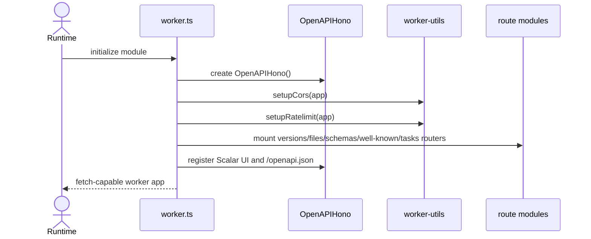
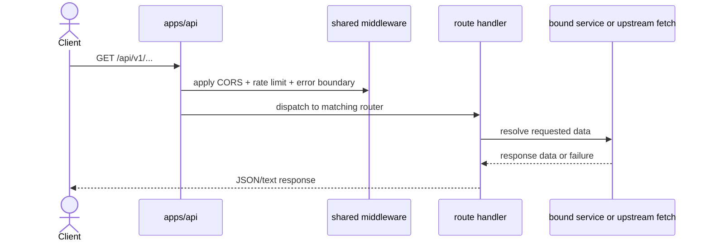
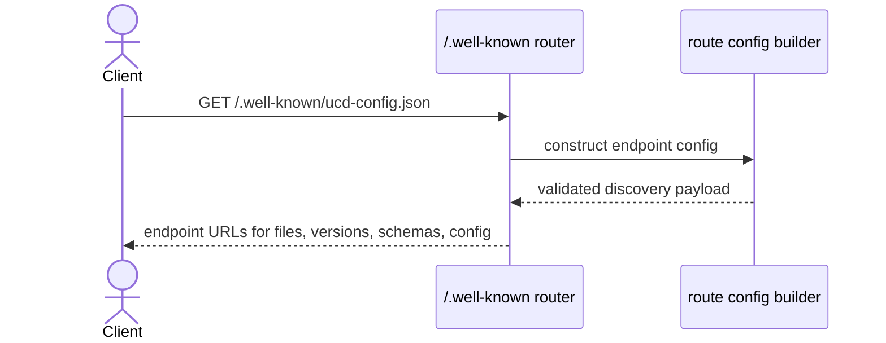
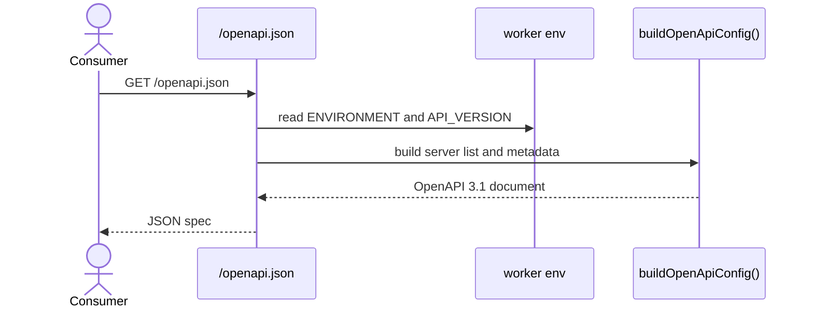

import { Cards, Card } from 'fumadocs-ui/components/card';

`apps/api` is the public HTTP worker for UCD.js.

## Role

- Serves the version, file, schema, well-known, and task endpoints.
- Publishes the `.well-known` discovery document used by `@ucdjs/client`.
- Owns the API-facing boundary between external consumers and upstream Unicode data services.

## Related Docs

<Cards>
  <Card title="Client" href="/architecture/packages/client" description="The client discovers and consumes the endpoints exposed by this app." />
  <Card title="Store App" href="/architecture/apps/store" description="The hosted store app is a separate filesystem-style surface built on related data." />
  <Card title="Worker Utils" href="/architecture/packages/worker-utils" description="Startup, CORS, rate limiting, and error handling are shared from worker-utils." />
  <Card title="Data Flow" href="/architecture/data-flow" description="See how upstream Unicode data becomes API responses and downstream store inputs." />
</Cards>

## Mental Model

The app has one Hono/OpenAPI process with three concerns:

- register the HTTP surface
- apply shared worker policy
- expose both machine-readable OpenAPI and human-readable API docs

It is the canonical network entrypoint for most public consumers.

## Request Flows

### Worker startup

### Normal API request

### Discovery request

### OpenAPI document request

## Design Notes

- Route modules own endpoint behavior, while `worker.ts` owns composition.
- OpenAPI and Scalar are first-class parts of the app, not afterthoughts.
- Discovery lives beside the main API because the client depends on one canonical source of endpoint truth.
- Shared middleware keeps this worker aligned with the store worker where possible.

## Testing Use

- route registration and request dispatch
- `.well-known` discovery payload correctness
- OpenAPI server selection by environment
- error and rate-limit behavior via shared worker-utils integration
