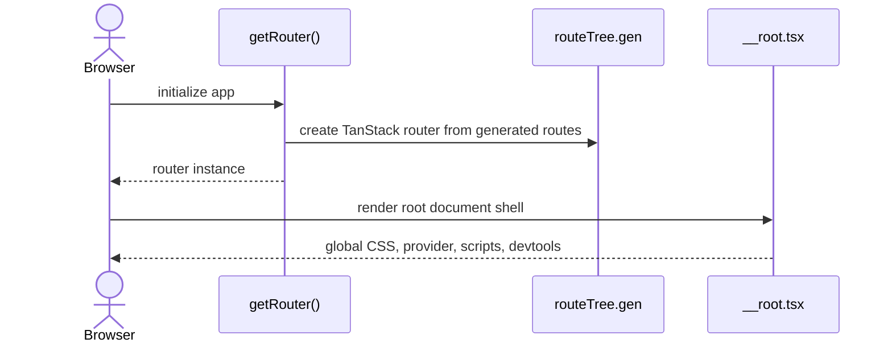
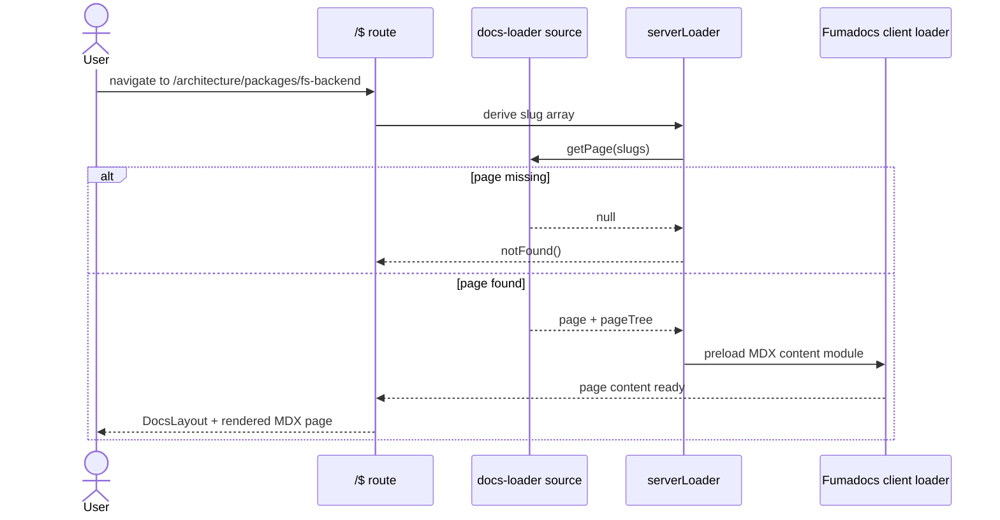
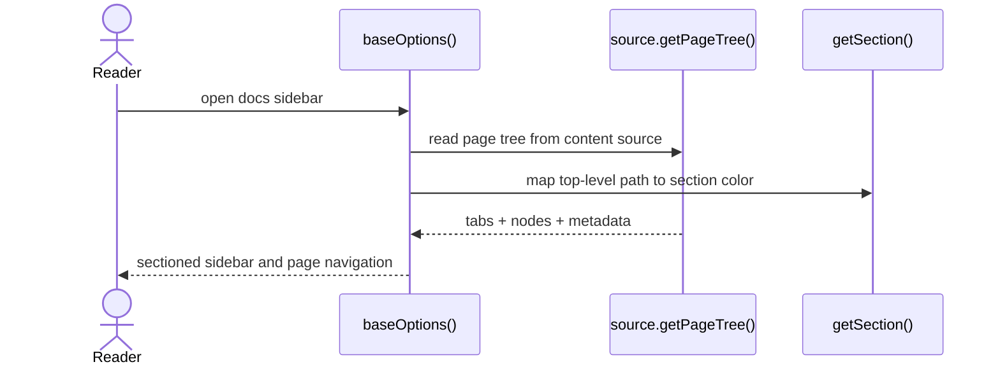

import { Cards, Card } from 'fumadocs-ui/components/card';

`apps/docs` is the documentation site for package guides, pipelines, and architecture notes.

## Role

- Loads MDX content from `apps/docs/content`.
- Renders it through TanStack Router and Fumadocs.
- Defines the navigation model that connects public docs, pipeline docs, and architecture docs.

## Related Docs

<Cards>
  <Card title="Architecture Index" href="/architecture" description="Top-level architecture entrypoint rendered by this app." />
  <Card title="Packages Overview" href="/architecture/packages" description="Grouped package architecture pages served by the docs app." />
  <Card title="Apps Overview" href="/architecture/apps" description="Application architecture pages served by the docs app." />
  <Card title="Shared UI" href="/architecture/packages/shared-ui" description="UI primitives and theme behavior that support docs rendering." />
</Cards>

## Mental Model

The docs app is a content-driven SPA with SSR support:

- Fumadocs indexes the MDX content tree
- TanStack Router serves a catch-all docs route
- the route resolves a page, serializes the page tree, and renders the MDX module

The page structure is largely data-driven by the content tree and `meta.json` files.

## Request Flows

### App bootstrap

### Docs page request

### Navigation model

## Design Notes

- The content tree is the source of truth for docs navigation.
- The catch-all route keeps the docs surface simple while still allowing section-aware behavior.
- Architecture discoverability depends as much on `meta.json` structure as on page prose.
- This app is a documentation renderer, not a place for package logic.

## Testing Use

- catch-all route loading and 404 behavior
- page-tree serialization
- section/tab mapping for packages, pipelines, architecture, and contributing
- rendering of MDX components and cross-page navigation
