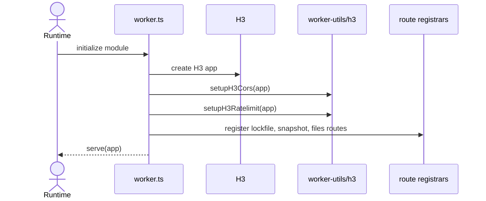
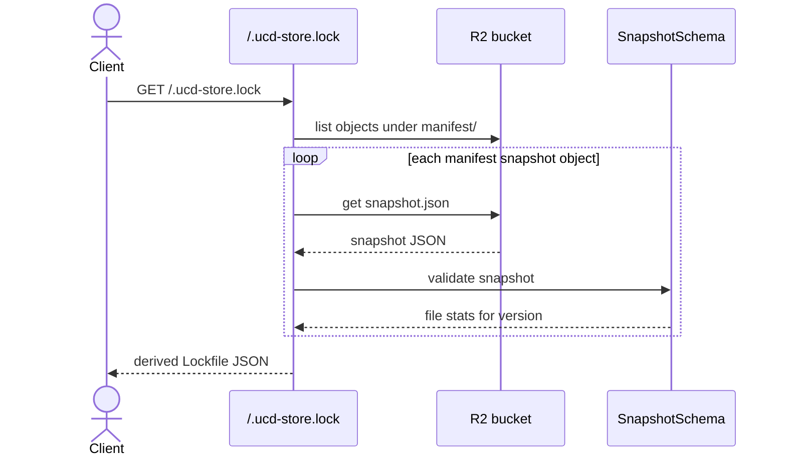
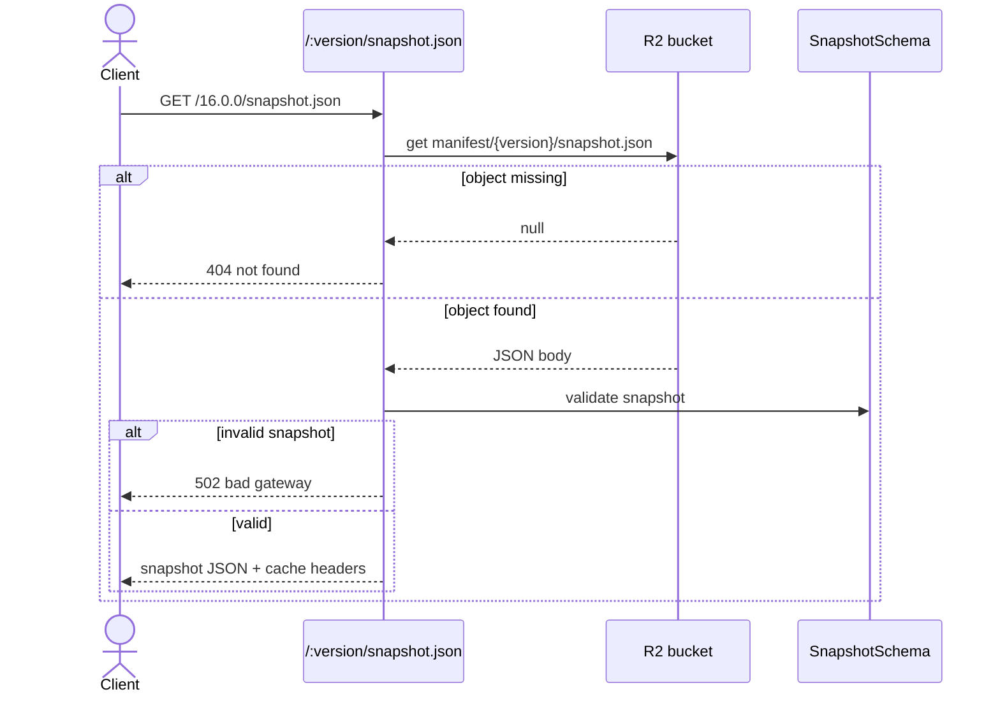
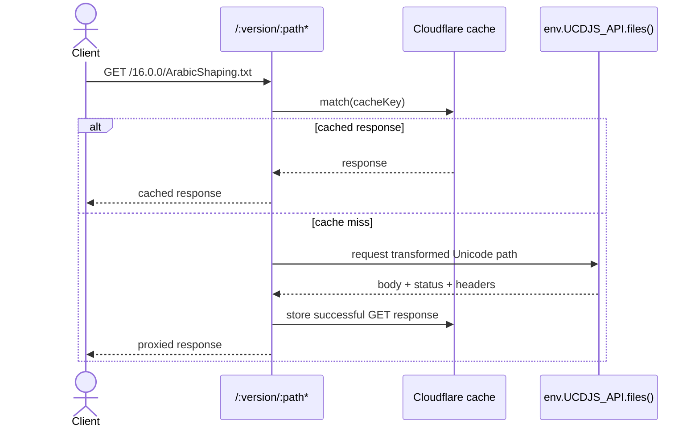

import { Cards, Card } from 'fumadocs-ui/components/card';

`apps/store` is the hosted filesystem-style HTTP surface for mirrored Unicode store content.

## Role

- Exposes a store-shaped read API for lockfiles, snapshots, and versioned files.
- Provides the HTTP contract consumed by the read-only `fs-backend` HTTP backend.
- Bridges Cloudflare storage/bindings and the higher-level `ucd-store` conventions.

## Related Docs

<Cards>
  <Card title="FS Backend" href="/architecture/packages/fs-backend" description="The HTTP backend reads from the route contract exposed by this app." />
  <Card title="Lockfile" href="/architecture/packages/lockfile" description="This app serves lockfile and snapshot-compatible JSON payloads." />
  <Card title="UCD Store" href="/architecture/packages/ucd-store" description="The store package can target this app through `createHTTPUCDStore()`." />
  <Card title="API App" href="/architecture/apps/api" description="The store worker proxies file data from the API while serving store-oriented metadata." />
</Cards>

## Mental Model

This app is not the main public API.
It is a filesystem facade with three route families:

- `/.ucd-store.lock`
- `/:version/snapshot.json`
- `/:version/:path*`

The app mainly exists so remote consumers can treat hosted store data like a read-only filesystem.

## Request Flows

### Worker startup

### Lockfile request

### Snapshot request

### File request

## Design Notes

- The lockfile is derived dynamically from stored snapshots, so the app can serve a store view even when only manifest artifacts are persisted.
- File requests proxy through the API binding rather than re-implementing Unicode file serving logic.
- The route shape intentionally matches the expectations of the HTTP filesystem backend.
- Cache headers matter because this app is read-heavy and mostly immutable by version.

## Testing Use

- route registration and fallback 404 behavior
- lockfile derivation from snapshot objects
- snapshot validation failures
- cache hit/miss behavior for file routes
- compatibility with the HTTP backend contract
