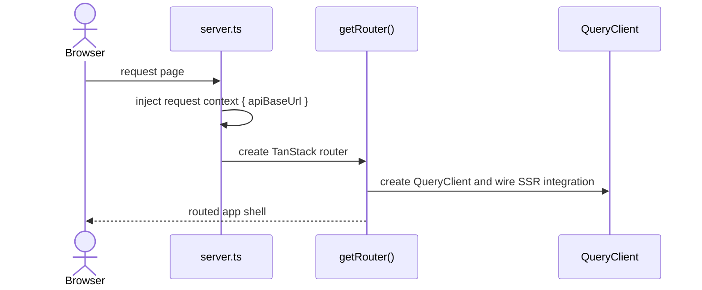
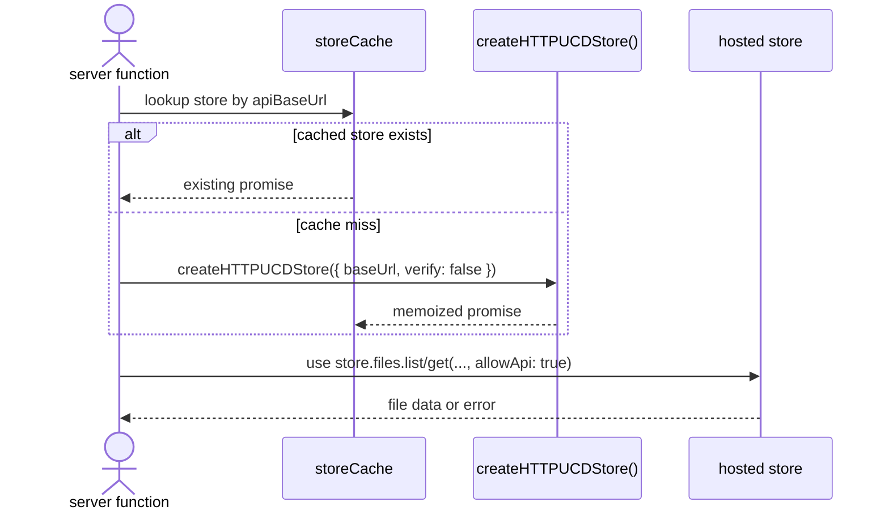
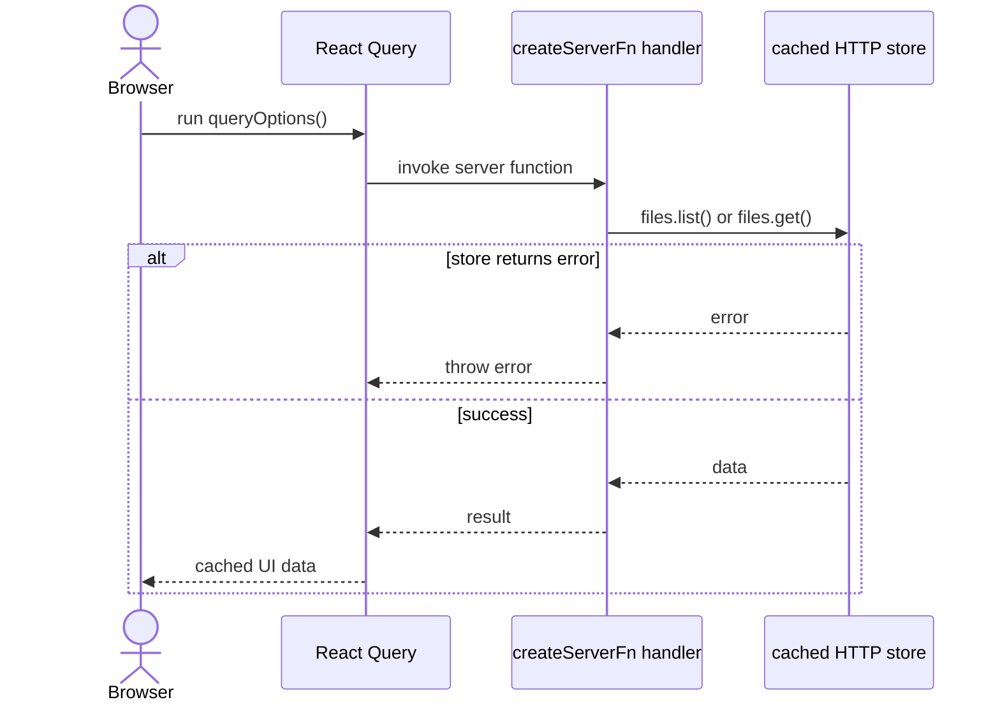

import { Cards, Card } from 'fumadocs-ui/components/card';

`apps/web` is the end-user web interface for browsing Unicode data and store-backed content.

## Role

- Renders the public frontend with TanStack Router and React Query.
- Uses server functions to talk to `ucd-store` from the server side.
- Bridges user navigation, SSR context, and data access without exposing store internals directly to the browser.

## Related Docs

<Cards>
  <Card title="UCD Store" href="/architecture/packages/ucd-store" description="Server functions cache and use HTTP-backed store instances." />
  <Card title="Client" href="/architecture/packages/client" description="Compare direct API-client consumption with the higher-level store path used here." />
  <Card title="Store App" href="/architecture/apps/store" description="The web app reads store data through server-side store instances targeting the hosted store." />
  <Card title="Docs App" href="/architecture/apps/docs" description="Both apps use TanStack Router, but this one is an end-user product UI." />
</Cards>

## Mental Model

The web app splits into two halves:

- client-side routing, React Query, and view composition
- server-side functions that create and cache HTTP `ucd-store` instances

That keeps file access on the server while still giving the browser a modern router/query model.

## Request Flows

### App bootstrap

### Server-side store access

### `listVersionFiles` and `getVersionFile`

## Design Notes

- The app prefers `ucd-store` over raw client calls for file-oriented reads.
- Store instances are cached per base URL to avoid rebuilding them on every server-function call.
- The browser does not need direct knowledge of store topology or file-serving details.
- `verify: false` keeps remote read access cheap for request-time usage.

## Testing Use

- server-function success and error behavior
- router/query integration with SSR context
- store caching per `apiBaseUrl`
- page flows that depend on file list and file content resolution
