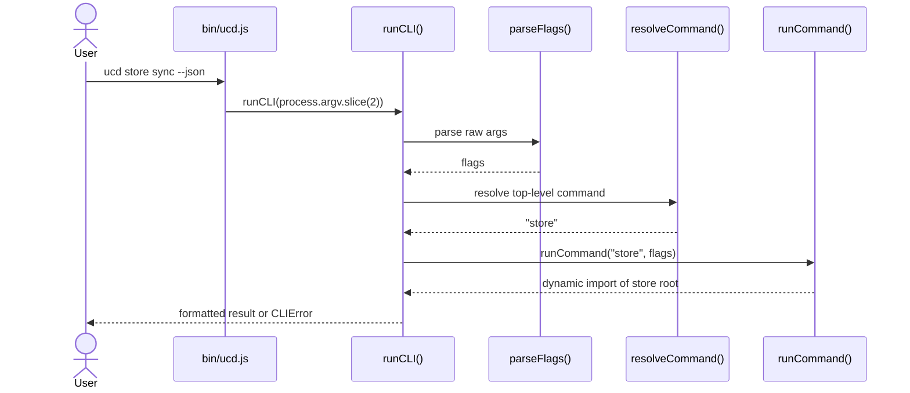
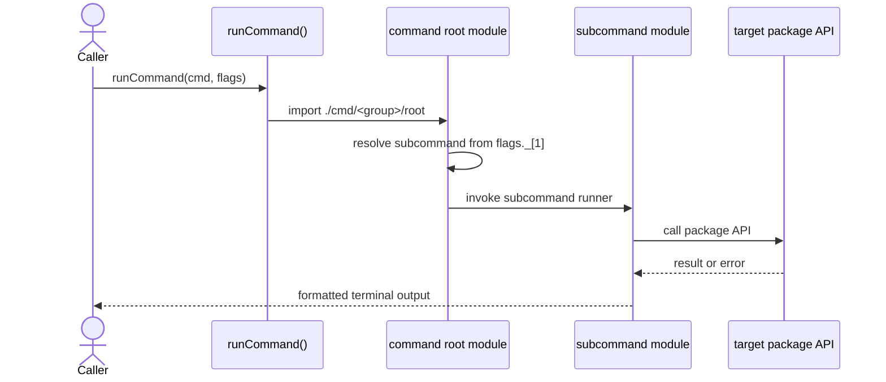
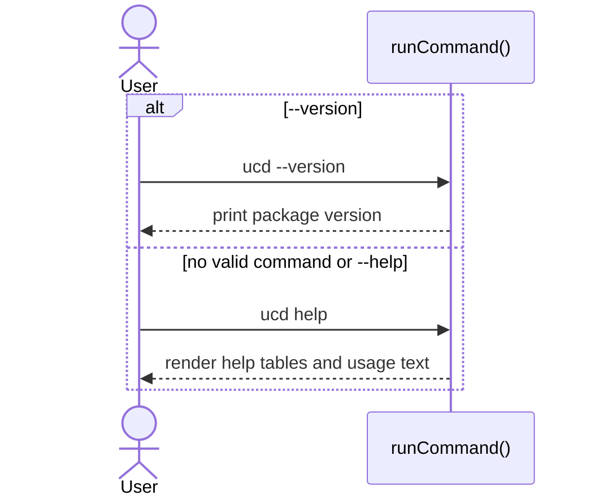

import { Cards, Card } from 'fumadocs-ui/components/card';

`@ucdjs/cli` is the human-facing command layer for store, files, lockfile, codegen, and pipeline workflows.

## Role

- Parses raw terminal arguments into command groups and subcommands.
- Delegates real work to package-level APIs instead of re-implementing storage or pipeline logic.
- Owns terminal output formatting, JSON mode, and command help text.

## Related Docs

<Cards>
  <Card title="Public Package Docs" href="/packages/cli" description="User-facing overview of commands and usage." />
  <Card title="UCD Store" href="/architecture/packages/ucd-store" description="Store commands wrap store initialization, mirror, sync, and verify flows." />
  <Card title="Lockfile" href="/architecture/packages/lockfile" description="Lockfile commands validate and inspect store metadata." />
  <Card title="Pipelines" href="/architecture/packages/pipelines" description="Pipeline commands load, list, and execute pipeline definitions." />
</Cards>

## Mental Model

The CLI is a thin dispatcher:

- `bin/ucd.js` passes `process.argv` into `runCLI()`
- `parseFlags()` and `resolveCommand()` identify the top-level command
- `runCommand()` lazy-loads the relevant command root
- subcommand modules call the real package APIs and render terminal output

## Method Flows

### CLI startup

### Command dispatch

### Help and version fast path

## Design Notes

- Top-level command modules are lazy-loaded so the startup path stays small.
- The CLI is intentionally a composition layer; storage, pipeline, and lockfile behavior should live in their own packages.
- JSON mode is handled in output helpers so commands can share the same rendering rules.
- Errors should be normalized into user-readable CLI output instead of leaking package stack traces by default.

## Testing Use

- top-level command resolution
- help and version output
- delegation to command roots and subcommands
- JSON output mode
- package-error normalization for store, lockfile, and pipeline commands
