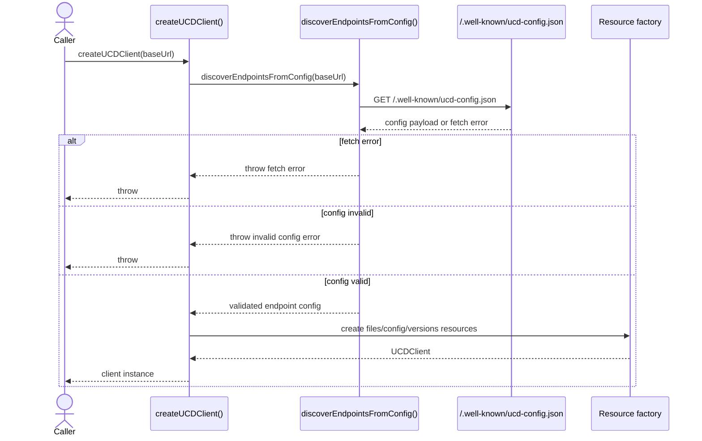
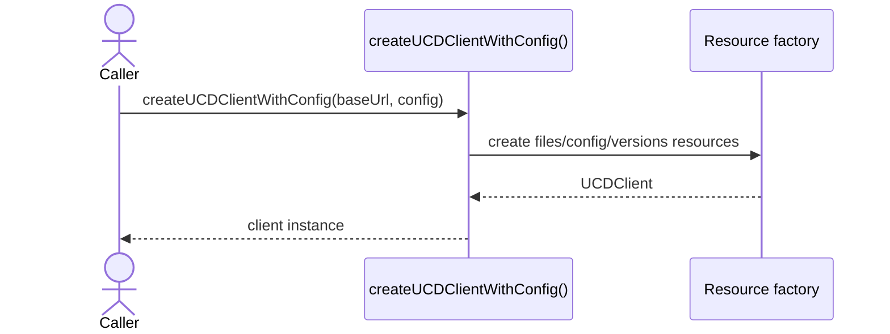
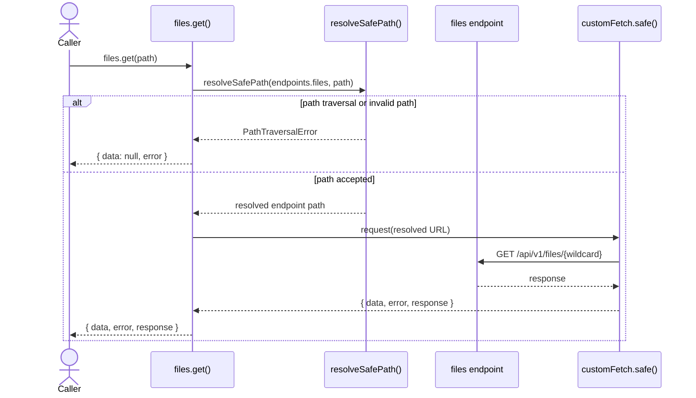
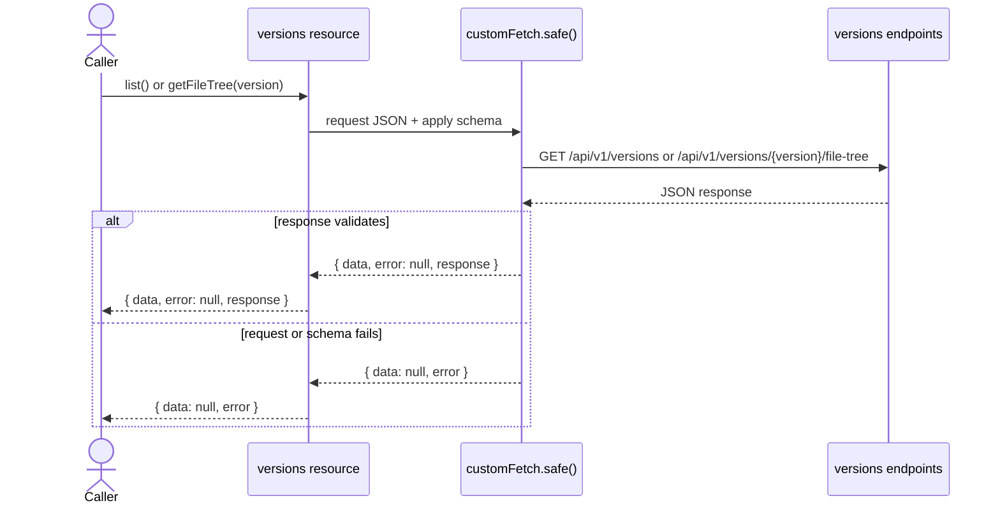
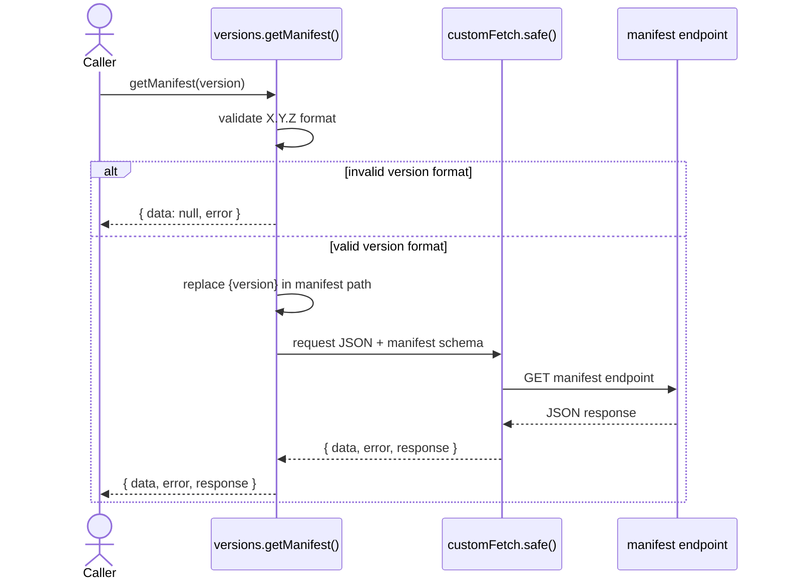
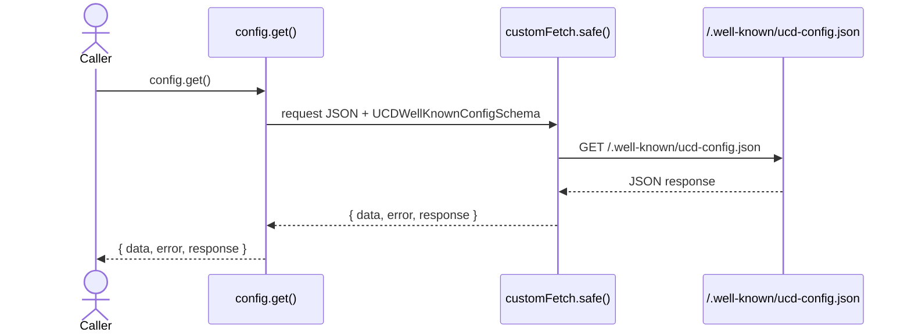

import { Cards, Card } from 'fumadocs-ui/components/card';

`@ucdjs/client` is the typed HTTP client for UCD.js services.

## Role

- Discovers endpoints from the `.well-known` config.
- Exposes typed resource wrappers for files, versions, and config.
- Defines the consumer-facing request and error contract used by higher-level packages.

## Related Docs

<Cards>
  <Card title="Public Package Docs" href="/packages/client" description="User-facing client overview and examples." />
  <Card title="Data Flow" href="/architecture/data-flow" description="See where client discovery and API consumption fit in the system." />
  <Card title="Package Layers" href="/architecture/package-layers" description="Understand how the client relates to schemas, env, and consumers." />
  <Card title="UCD Store" href="/architecture/packages/ucd-store" description="See how ucd-store uses the client for discovery, manifests, trees, and file fetches." />
</Cards>

## Mental Model

The client has two construction modes:

- `createUCDClient(baseUrl)` performs `.well-known` discovery first
- `createUCDClientWithConfig(baseUrl, config)` skips discovery and builds resources directly

Once constructed, the client exposes three resource namespaces:

- `config`
- `files`
- `versions`

Each resource returns `{ data, error }` style results instead of throwing for normal request failures.
The main exception is endpoint discovery, where `createUCDClient()` throws if the `.well-known`
document cannot be fetched or validated.

## Method Flows

### `createUCDClient(baseUrl)`

### `createUCDClientWithConfig(baseUrl, config)`

### `client.files.get(path)`

### `client.versions.list()` and `client.versions.getFileTree(version)`

### `client.versions.getManifest(version)`

### `client.config.get()`

## Testing Use

These diagrams also define the most useful client test buckets:

- discovery success, fetch failure, and invalid `.well-known` config
- safe-path validation for `files.get()`
- successful resource fetches with schema validation
- invalid version format for `getManifest()`
- normalization of request failures into `{ data, error }`
