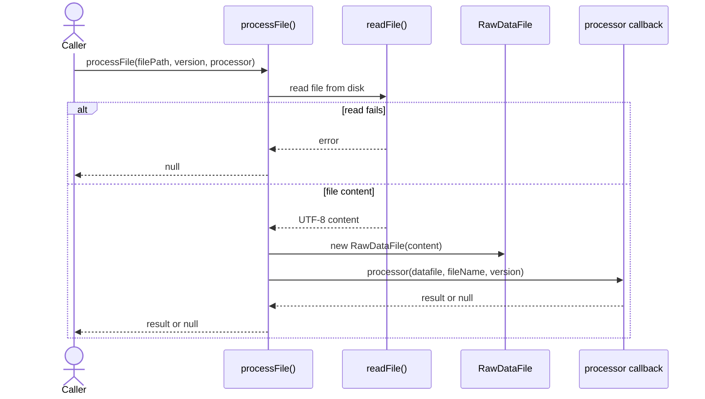
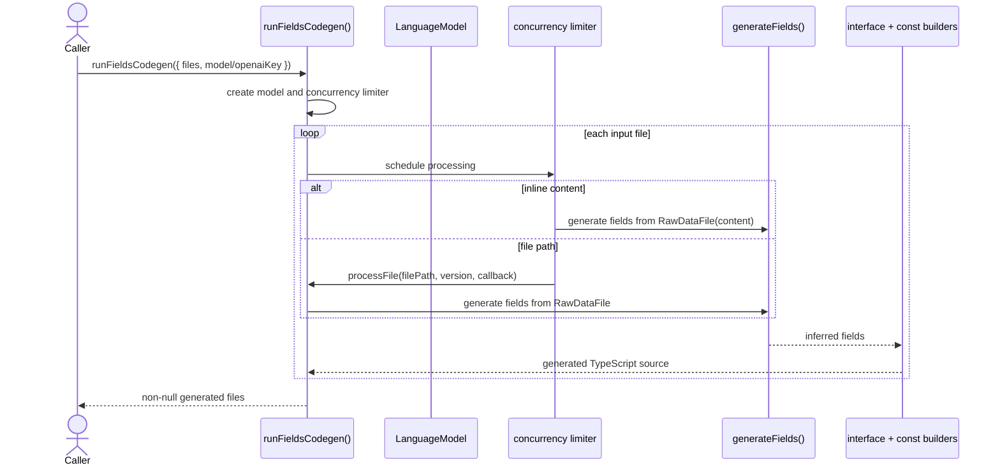
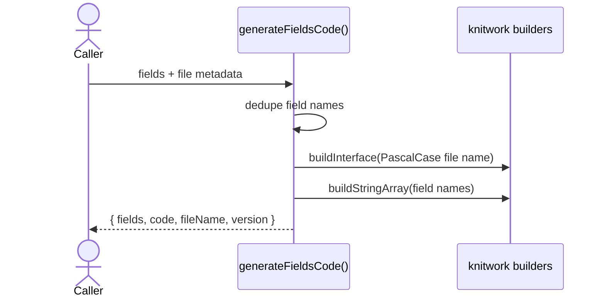

import { Cards, Card } from 'fumadocs-ui/components/card';

`@ucdjs/codegen` turns raw Unicode data files into generated TypeScript artifacts.

## Role

- Loads raw UCD text files into `RawDataFile` structures.
- Uses model-driven field generation to infer property typings.
- Produces generated interfaces and field-name constants for downstream packages.

## Related Docs

<Cards>
  <Card title="Public Package Docs" href="/packages/codegen" description="User-facing overview of field generation and file processing." />
  <Card title="CLI" href="/architecture/packages/cli" description="The CLI delegates `codegen` commands into this package." />
  <Card title="Pipeline Presets" href="/architecture/packages/pipelines/presets" description="Pipelines transform raw UCD text, while codegen produces TypeScript artifacts from files." />
  <Card title="Schemas" href="/architecture/packages/schemas" description="Generated code often feeds or complements typed data contracts." />
</Cards>

## Mental Model

There are two layers:

- `processFile()` is the shared file-loading primitive
- `runFieldsCodegen()` is the higher-level orchestration for field inference and code emission

The package is intentionally narrow. It does not own store discovery or output persistence.
It accepts files, processes them, and returns generated content.

## Method Flows

### `processFile(filePath, version, processor)`

### `runFieldsCodegen()`

### Generated artifact assembly

## Design Notes

- `processFile()` deliberately returns `null` on failure so batch codegen can continue.
- Field inference is model-based, but code emission is deterministic once fields are known.
- Concurrency limiting happens at the orchestration layer rather than inside the processor callback.
- Generated identifiers are sanitized before code emission.

## Testing Use

- disk-backed vs inline-content processing
- processor failure and null filtering
- duplicate field-name handling
- deterministic code emission from inferred fields
- model wiring and concurrency behavior in `runFieldsCodegen()`
