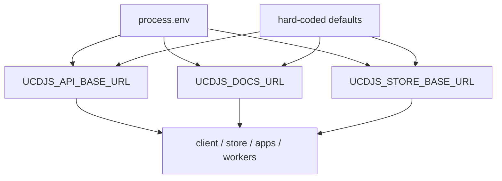
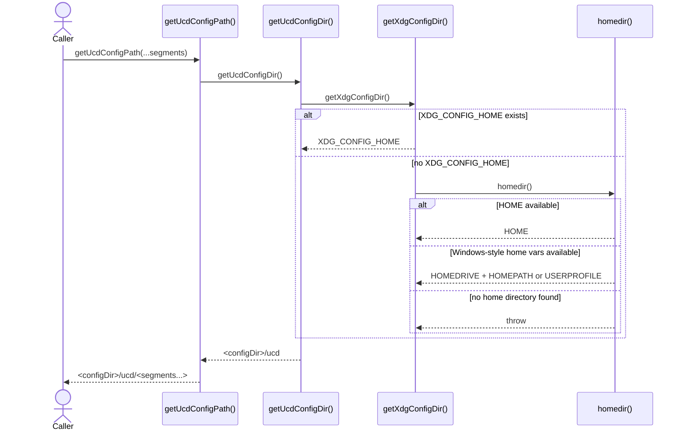
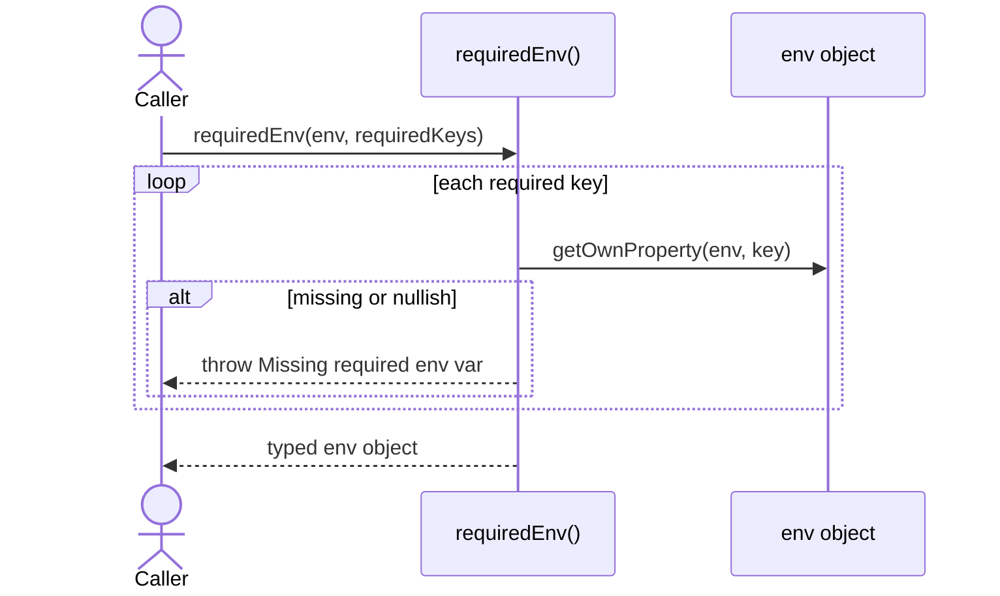
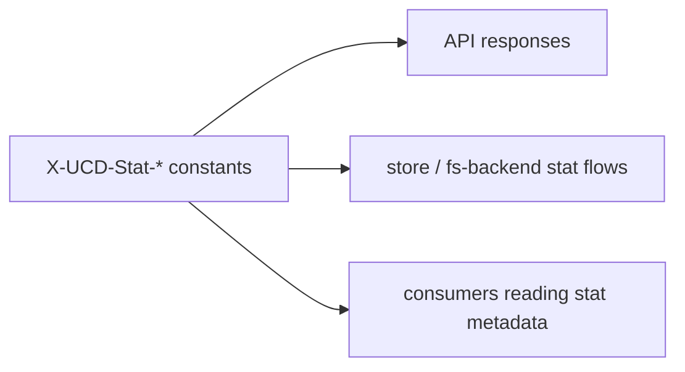

import { Cards, Card } from 'fumadocs-ui/components/card';

`@ucdjs/env` centralizes shared runtime constants and small environment helpers.

## Role

- Defines default public origins and shared HTTP metadata header names.
- Resolves config directory paths for local tooling.
- Validates required environment bindings when callers need fail-fast behavior.

## Related Docs

<Cards>
  <Card title="Package Layers" href="/architecture/package-layers" description="See where env sits in the lowest public dependency layer." />
  <Card title="Client" href="/architecture/packages/client" description="Client uses env-provided defaults such as the base API origin." />
  <Card title="UCD Store" href="/architecture/packages/ucd-store" description="Store factories and discovery flows rely on env defaults." />
  <Card title="Schemas" href="/architecture/packages/schemas" description="Env and schemas form the base contract/config layer for the workspace." />
</Cards>

## Mental Model

`@ucdjs/env` does not own business logic. It owns shared runtime values that would
otherwise turn into duplicated string literals or ad hoc environment checks.

The package has three kinds of exports:

- static header-name constants
- origin/config defaults derived from `process.env`
- tiny helpers such as `requiredEnv()` and local config path resolution

## Constant Resolution

## Method Flows

### `getUcdConfigPath(...segments)`

### `requiredEnv(env, requiredKeys)`

### Header Constants

## Testing Use

The most useful tests for this package are:

- env override vs fallback default behavior
- XDG/home-directory resolution across platform-style env combinations
- `requiredEnv()` success and fail-fast error cases
- stability of shared HTTP header names
