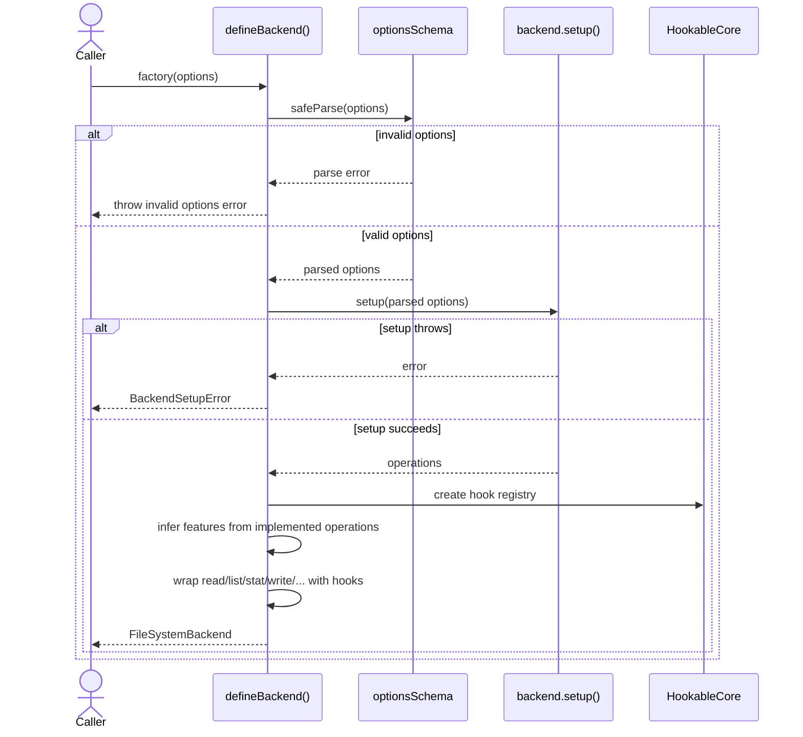
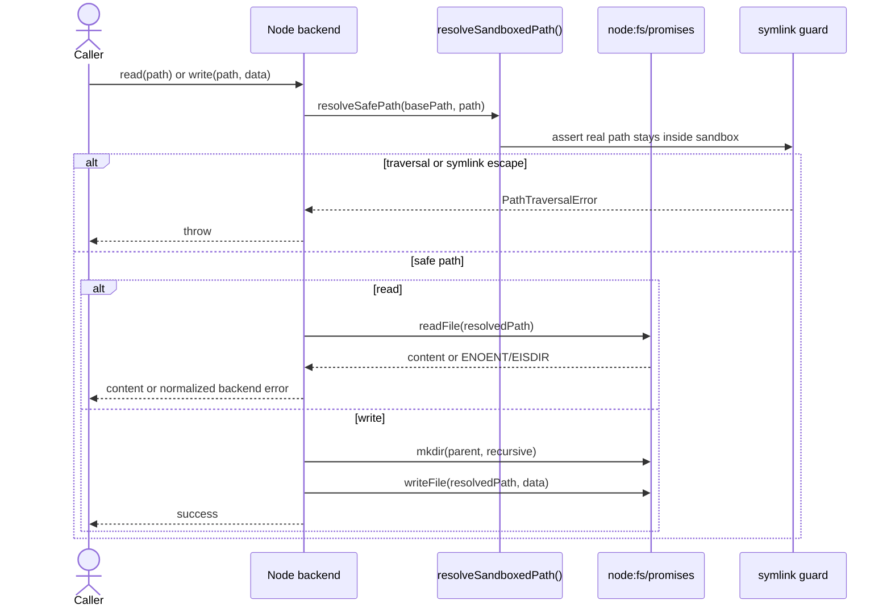
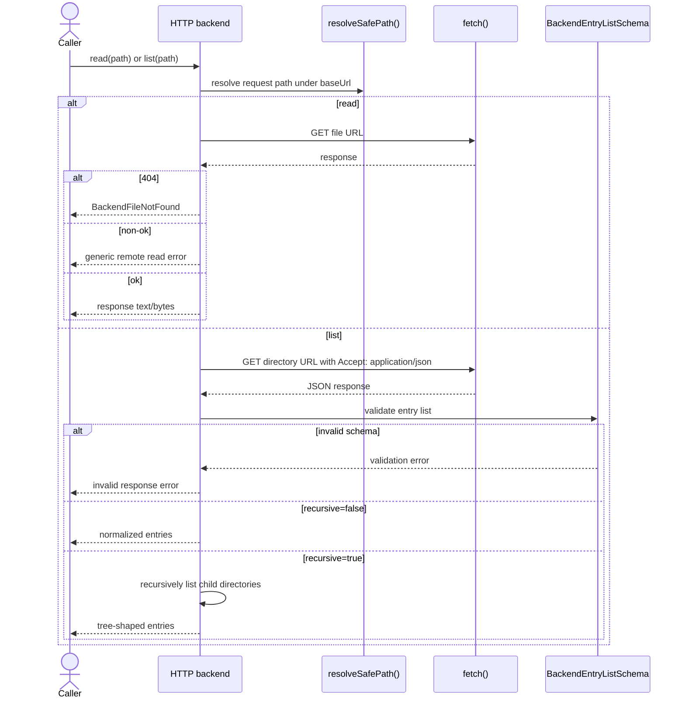

import { Cards, Card } from 'fumadocs-ui/components/card';

`@ucdjs/fs-backend` is the filesystem abstraction layer used across the storage stack.

## Role

- Defines the common backend contract used by `ucd-store`, `lockfile`, and test helpers.
- Lets higher-level storage code work against one capability model instead of hard-coding Node or HTTP.
- Centralizes path safety, feature detection, and backend-specific error normalization.

## Related Docs

<Cards>
  <Card title="Public Package Docs" href="/packages/fs-backend" description="User-facing overview of the backend contract and built-in backends." />
  <Card title="UCD Store" href="/architecture/packages/ucd-store" description="See how the store consumes backend features for reads, mirroring, and sync." />
  <Card title="Lockfile" href="/architecture/packages/lockfile" description="See how lockfile reads and writes depend on backend mutability." />
  <Card title="Path Utils" href="/architecture/packages/path-utils" description="Path normalization and traversal protection used by the built-in backends." />
</Cards>

## Mental Model

`fs-backend` has three layers:

- `defineBackend()` turns a small backend definition into a full `FileSystemBackend`
- built-in backends implement the actual operations
- consumers branch on `features` instead of checking environment type directly

The important distinction is capability, not platform:

- Node backend: mutable, directory-aware, sandboxed to a base path
- HTTP backend: read-only, request-based, safe-path constrained to a base URL
- custom backends: anything that can satisfy the contract

## Method Flows

### `defineBackend()`

### Node backend read and write flow

### HTTP backend read and list flow

## Design Notes

- Feature detection is inferred from the operations actually implemented, which keeps custom backends honest.
- The Node backend applies both lexical path checks and real-path symlink checks.
- The HTTP backend is intentionally read-only and uses headers to infer `stat()` information.
- `ucd-store` should branch on `features` and `isHttpBackend()` rather than directly inspecting backend names.

## Testing Use

The highest-value backend tests map to these buckets:

- invalid factory options and setup failures
- traversal protection and symlink escape rejection
- Node error normalization for missing files vs wrong entry type
- HTTP `read`, `list`, `exists`, and `stat` behavior with 404 and schema failures
- feature inference and hook wrapping for custom backends
