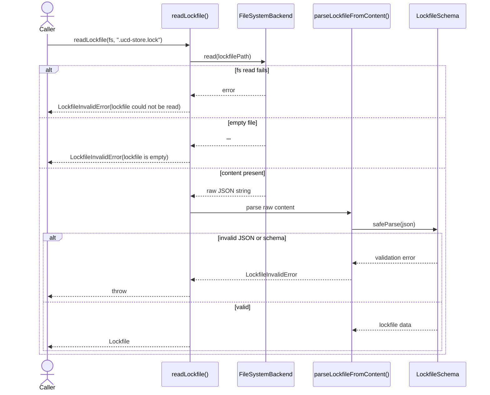
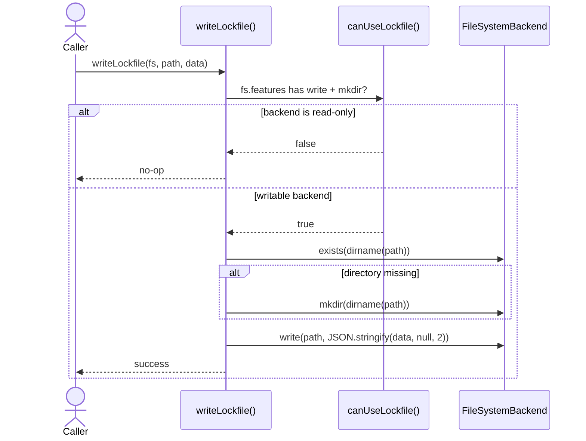
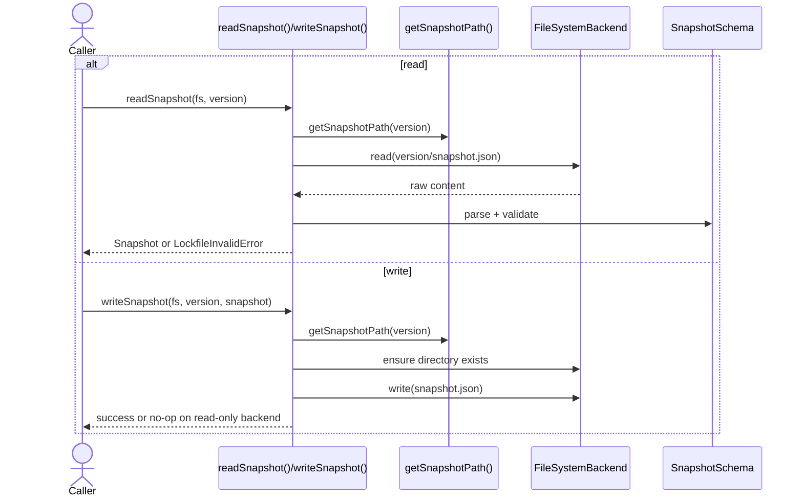

import { Cards, Card } from 'fumadocs-ui/components/card';

`@ucdjs/lockfile` owns the persistent metadata format for mirrored UCD stores.

## Role

- Validates `.ucd-store.lock` and per-version `snapshot.json` files.
- Encodes the contract between `ucd-store`, writable backends, and store-serving apps.
- Separates metadata integrity checks from the higher-level store lifecycle.

## Related Docs

<Cards>
  <Card title="Public Package Docs" href="/packages/lockfile" description="User-facing overview of lockfile helpers and snapshot parsing." />
  <Card title="UCD Store" href="/architecture/packages/ucd-store" description="See where lockfile reads, writes, and conflict resolution happen." />
  <Card title="FS Backend" href="/architecture/packages/fs-backend" description="Lockfile persistence depends on backend `write` and `mkdir` support." />
  <Card title="Store App" href="/architecture/apps/store" description="The hosted store app serves lockfile and snapshot data over HTTP." />
</Cards>

## Mental Model

The package has two data shapes:

- lockfile: store-level metadata for resolved versions and filters
- snapshot: version-level file manifest with hashes and sizes

And two usage modes:

- strict parsing APIs that throw typed errors
- permissive `OrUndefined` APIs for best-effort reads

## Method Flows

### `readLockfile()`

### `writeLockfile()`

### Snapshot lifecycle

## Design Notes

- `canUseLockfile()` is a capability check, not a backend-type check.
- Invalid content is normalized into `LockfileInvalidError` so higher-level code can present consistent errors.
- Parsing helpers exist both for filesystem-backed reads and raw string content from HTTP or memory.
- Snapshot paths are version-derived, which keeps store metadata deterministic.

## Testing Use

- strict vs permissive parse helpers
- invalid JSON and invalid schema branches
- write skipping on read-only backends
- directory creation on first write
- parity between raw-content parse helpers and filesystem-backed reads
