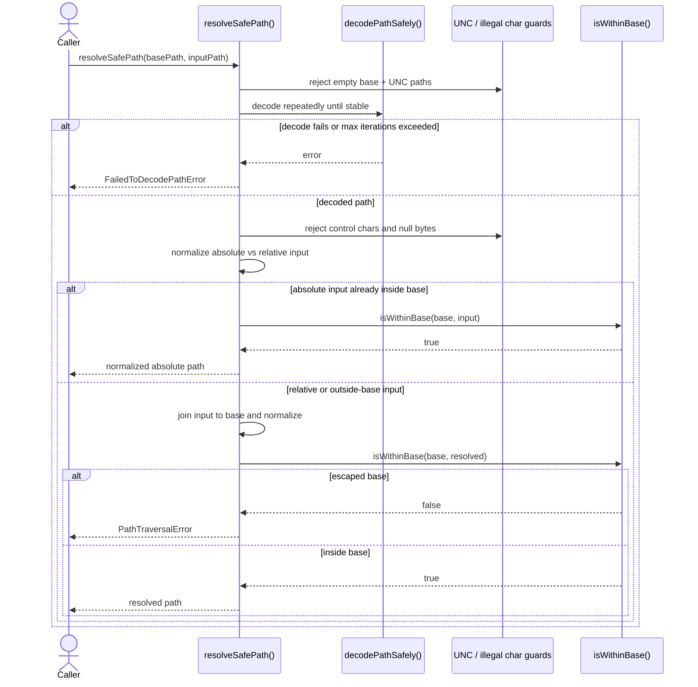
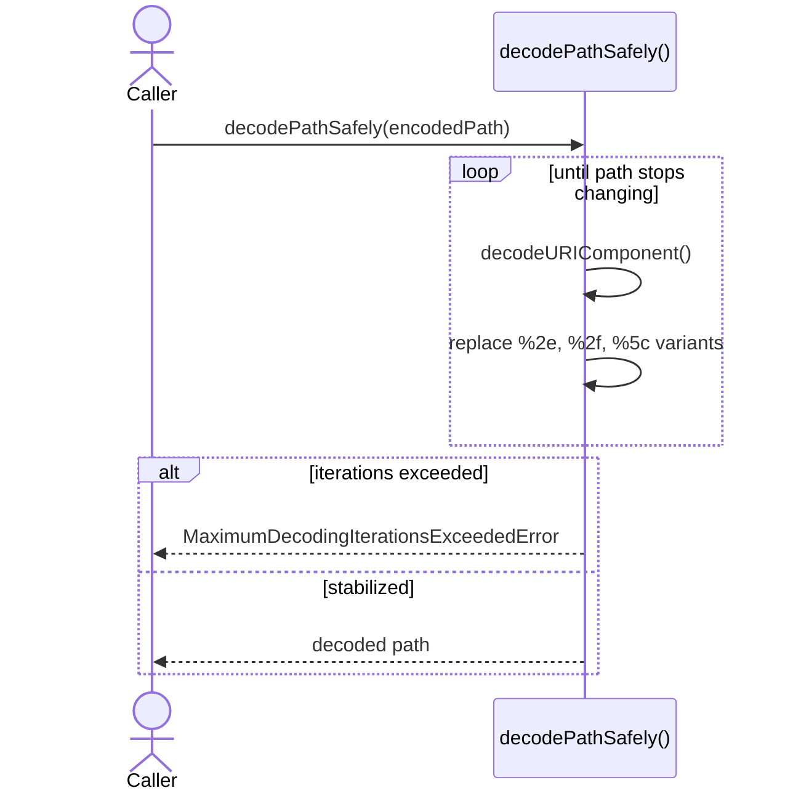
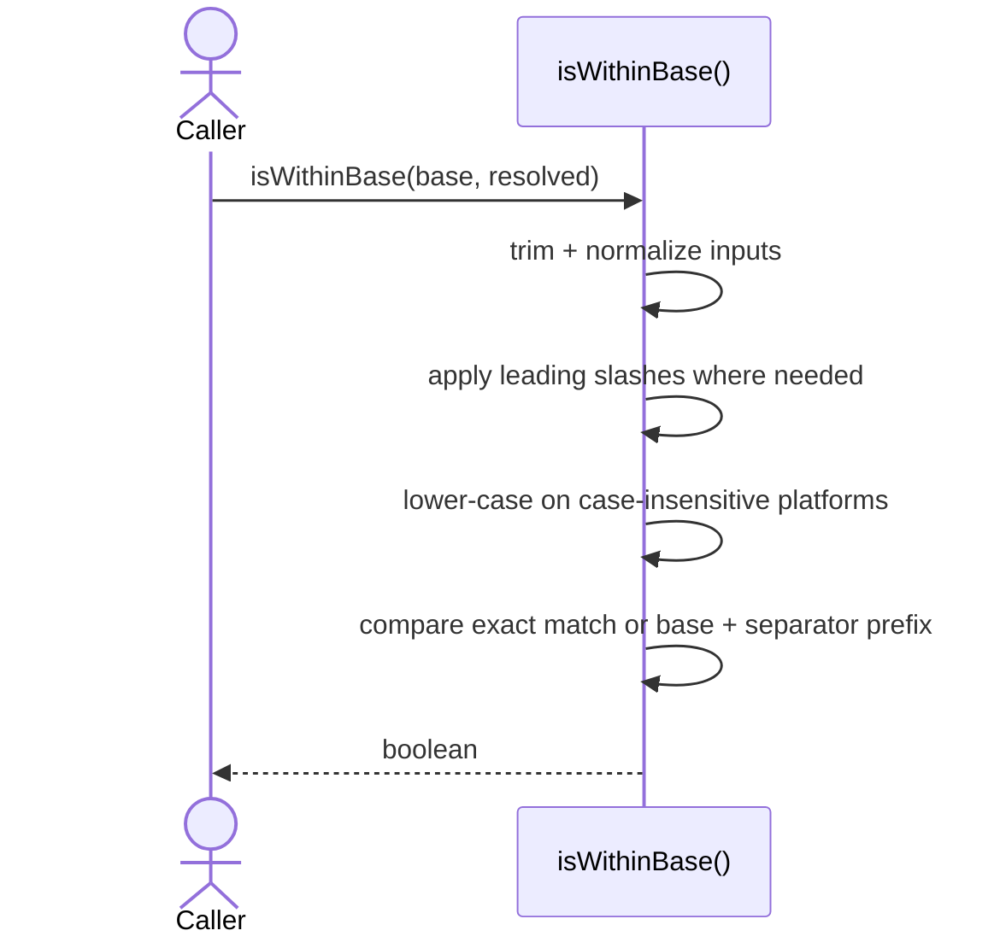

import { Cards, Card } from 'fumadocs-ui/components/card';

`@ucdjs/path-utils` is the path safety layer that protects storage and HTTP file access.

## Role

- Normalizes path handling across Node, HTTP, and mixed platform environments.
- Rejects traversal, illegal characters, unsupported UNC paths, and Windows-drive mismatches.
- Provides the safety boundary reused by `fs-backend`, `client`, and store-serving code.

## Related Docs

<Cards>
  <Card title="Public Package Docs" href="/packages/path-utils" description="User-facing overview of safe path helpers and platform utilities." />
  <Card title="FS Backend" href="/architecture/packages/fs-backend" description="Built-in backends rely on these checks before touching files or URLs." />
  <Card title="Client" href="/architecture/packages/client" description="Client file requests use safe path resolution before network fetches." />
  <Card title="Store App" href="/architecture/apps/store" description="The hosted store path shape mirrors the same safety assumptions." />
</Cards>

## Mental Model

There are two main responsibilities:

- decode and normalize user-provided paths safely
- prove that the resolved path still stays inside an allowed base

The core primitive is `resolveSafePath(basePath, inputPath)`.
Everything else supports that decision.

## Method Flows

### `resolveSafePath(basePath, inputPath)`

### `decodePathSafely()`

### `isWithinBase()`

## Design Notes

- URL decoding is iterative because traversal attempts may be double-encoded.
- Windows behavior is treated explicitly, including drive handling and unsupported UNC paths.
- `isWithinBase()` avoids partial prefix mistakes like `/root` matching `/root2`.
- This package does lexical path safety only; the Node backend adds real-path symlink checks on top.

## Testing Use

- repeated encoded traversal attempts
- Windows drive and case-sensitivity edge cases
- UNC path rejection
- control-character and null-byte rejection
- absolute input that is already valid vs absolute input that escapes base
