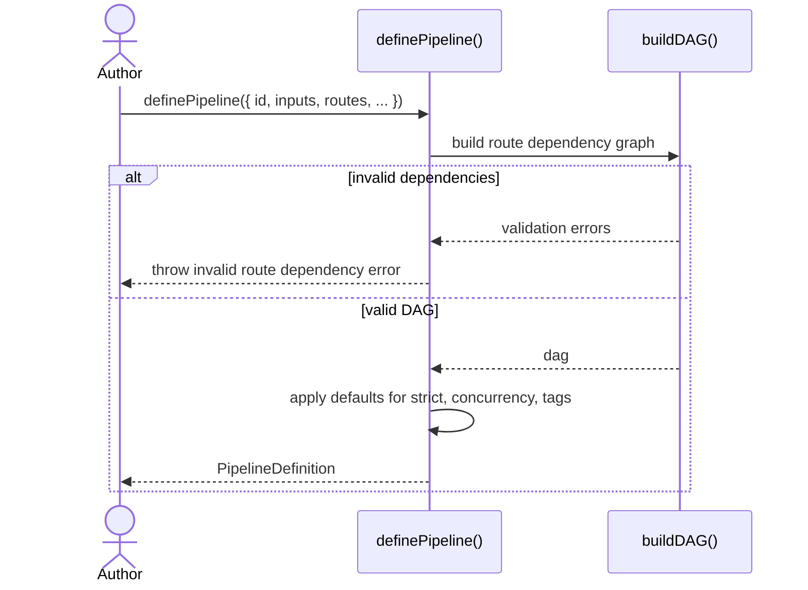
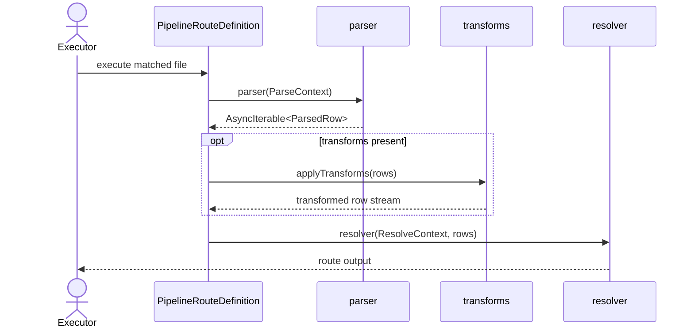
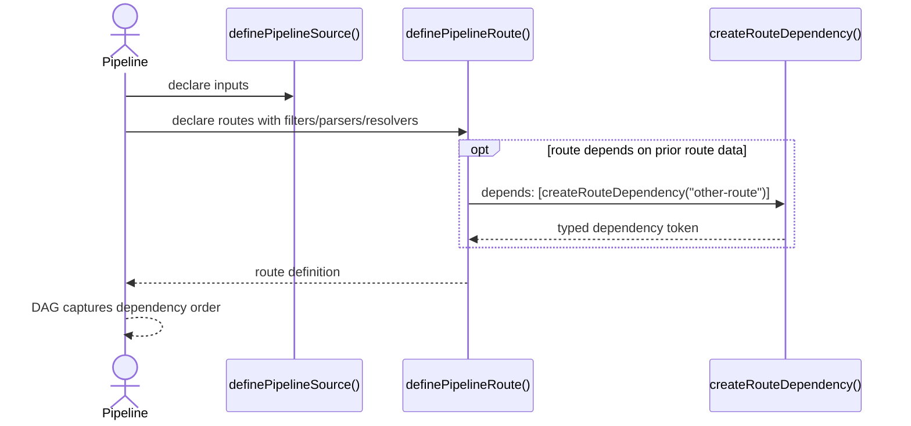

import { Cards, Card } from 'fumadocs-ui/components/card';

`@ucdjs/pipeline-core` defines the pipeline DSL used to describe Unicode data processing.

## Role

- Defines pipelines, sources, routes, filters, transforms, outputs, and tracing shapes.
- Validates route dependency graphs at definition time.
- Provides the pure data model that executors and visualizers consume.

## Related Docs

<Cards>
  <Card title="Pipeline Executor" href="/architecture/packages/pipelines/executor" description="The executor runs the definitions produced by pipeline-core." />
  <Card title="Pipeline Graph" href="/architecture/packages/pipelines/graph" description="Graph tools visualize and analyze the dependency model defined here." />
  <Card title="Pipeline Presets" href="/architecture/packages/pipelines/presets" description="Presets package prebuilds common sources, parsers, and routes on top of the DSL." />
  <Card title="Pipeline Loader" href="/architecture/packages/pipelines/loader" description="The loader discovers files that export pipeline definitions from this package." />
</Cards>

## Mental Model

`pipeline-core` is definition-time code, not runtime orchestration.

The key concepts are:

- pipeline: a complete processing plan across versions
- source: where files come from
- route: how matching files are parsed and resolved
- fallback: what happens to unmatched files
- DAG: route dependency order

The package returns immutable data structures that other packages execute.

## Method Flows

### `definePipeline()`

### Route execution contract

### Source and dependency model

## Design Notes

- Definition-time validation is deliberate so invalid pipelines fail before execution starts.
- The package does not know about filesystem layout, caching, or UI.
- `PipelineDefinition` is intentionally pure data plus precomputed DAG metadata.
- The DSL is expressive enough for both tiny sample pipelines and large preset-driven pipelines.

## Testing Use

- invalid DAG detection
- filter composition and matching behavior
- route dependency typing and ordering
- output normalization contracts
- transform chaining and fallback behavior
