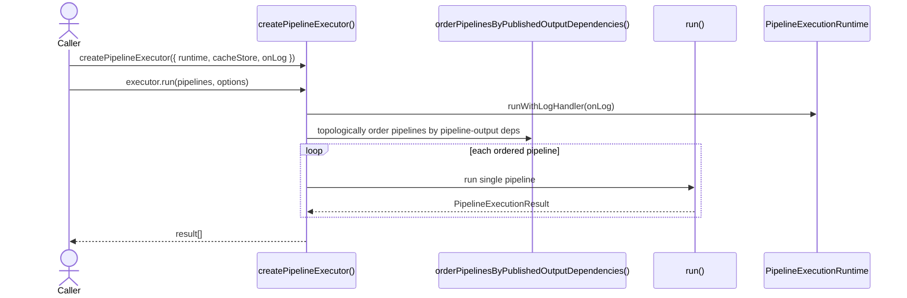
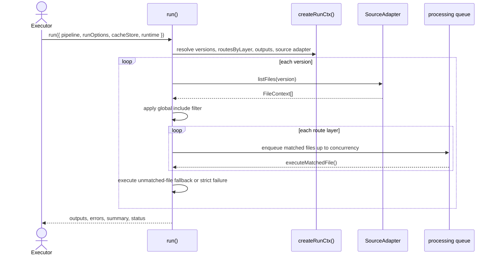
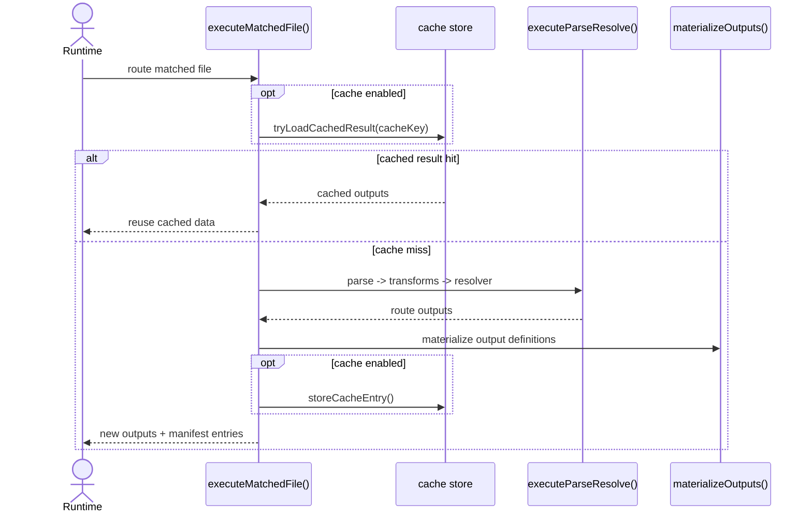

import { Cards, Card } from 'fumadocs-ui/components/card';

`@ucdjs/pipeline-executor` is the runtime that executes pipeline definitions against source files.

## Role

- Orders pipelines and routes, resolves versions, and executes matched files.
- Applies caching, tracing, logging, and output materialization.
- Turns pure pipeline definitions into concrete execution results.

## Related Docs

<Cards>
  <Card title="Pipeline Core" href="/architecture/packages/pipelines/core" description="The executor consumes definitions created by pipeline-core." />
  <Card title="Pipeline Graph" href="/architecture/packages/pipelines/graph" description="Graph tools explain the dependency structure that the executor follows." />
  <Card title="Pipeline Server" href="/architecture/packages/pipelines/server" description="The server package visualizes and runs executions powered by this runtime." />
  <Card title="Pipeline Presets" href="/architecture/packages/pipelines/presets" description="Preset pipelines are a common input to the executor." />
</Cards>

## Mental Model

The executor has two layers:

- `createPipelineExecutor()` orders multiple pipelines and wraps execution in runtime logging
- `run()` executes one pipeline version-by-version and route-by-route

The critical runtime responsibilities are:

- source listing
- route matching
- parse/transform/resolve execution
- cache lookup and writeback
- output materialization and summary creation

## Method Flows

### `createPipelineExecutor().run()`

### Single pipeline execution

### Matched file execution

## Design Notes

- Pipeline ordering happens before execution so pipeline-output dependencies can cross pipeline boundaries.
- Route ordering happens inside a pipeline through the DAG layers from pipeline-core.
- The runtime abstraction owns spans, logging, and output capture so execution remains portable.
- Errors are accumulated into execution results instead of crashing the whole batch whenever possible.

## Testing Use

- pipeline ordering and circular dependency failures
- route-layer execution and concurrency behavior
- cache hit/miss behavior
- fallback and strict unmatched-file handling
- summary accounting, tracing, and failure accumulation
