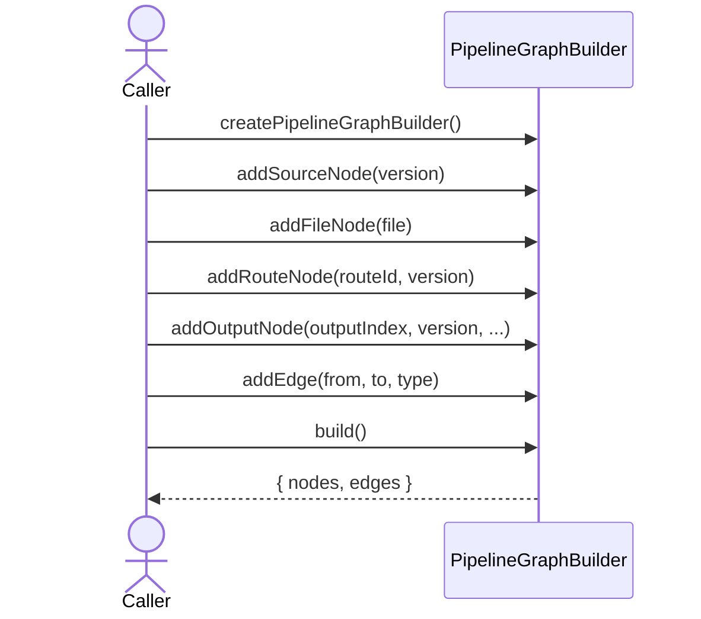
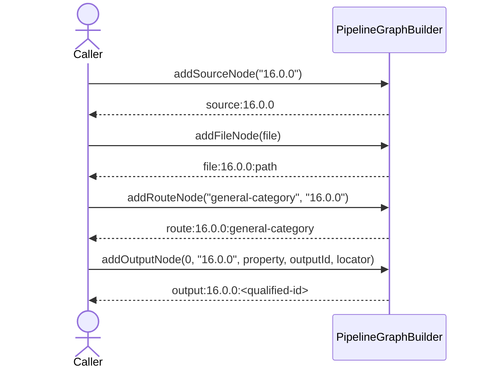
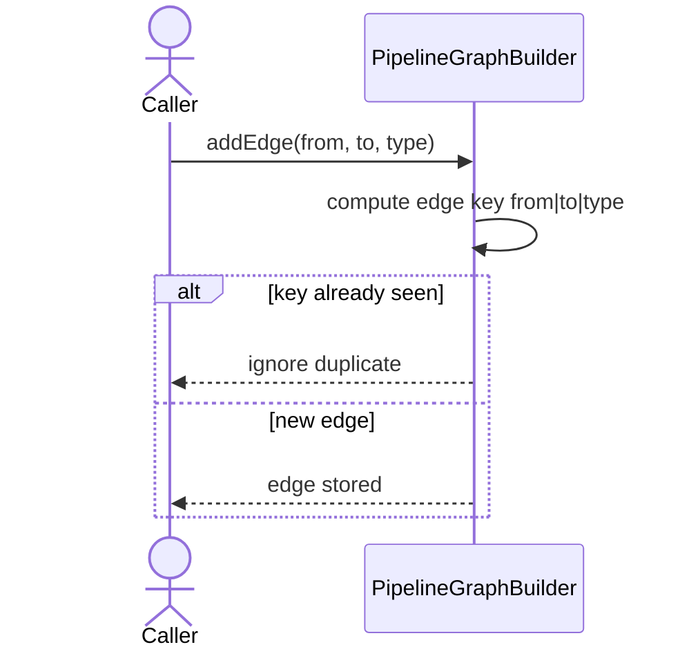

import { Cards, Card } from 'fumadocs-ui/components/card';

`@ucdjs/pipeline-graph` builds graph representations of pipeline definitions for analysis and visualization.

## Role

- Converts sources, files, routes, and outputs into graph nodes and edges.
- Supports server/UI features that inspect pipeline topology and execution structure.
- Keeps graph-building logic out of the executor and UI layers.

## Related Docs

<Cards>
  <Card title="Pipeline Core" href="/architecture/packages/pipelines/core" description="Graph nodes are derived from pipeline-core definitions and file contexts." />
  <Card title="Pipeline Executor" href="/architecture/packages/pipelines/executor" description="The executor follows dependency order while graph tools render and inspect it." />
  <Card title="Pipeline Server" href="/architecture/packages/pipelines/server" description="The pipeline UI uses graph outputs to visualize relationships." />
  <Card title="Pipelines Overview" href="/architecture/packages/pipelines" description="Return to the pipeline package-family index." />
</Cards>

## Mental Model

This package is a view-model builder for pipelines.

The core builder turns four kinds of entities into nodes:

- source/version nodes
- file nodes
- route nodes
- output nodes

Edges describe how data moves between them.

## Method Flows

### Graph builder lifecycle

### Node creation rules

### Deduplicated edge building

## Design Notes

- Node IDs are deterministic so multiple graph passes can merge or compare safely.
- Output nodes can carry richer metadata like property names, output IDs, and locators.
- The builder is mutable during construction but returns plain graph data on `build()`.
- This package stays intentionally narrow: graph modeling, not execution or layout physics.

## Testing Use

- stable node ID generation
- edge deduplication
- output-node metadata merging
- server/UI graph conversion utilities on top of the raw builder
