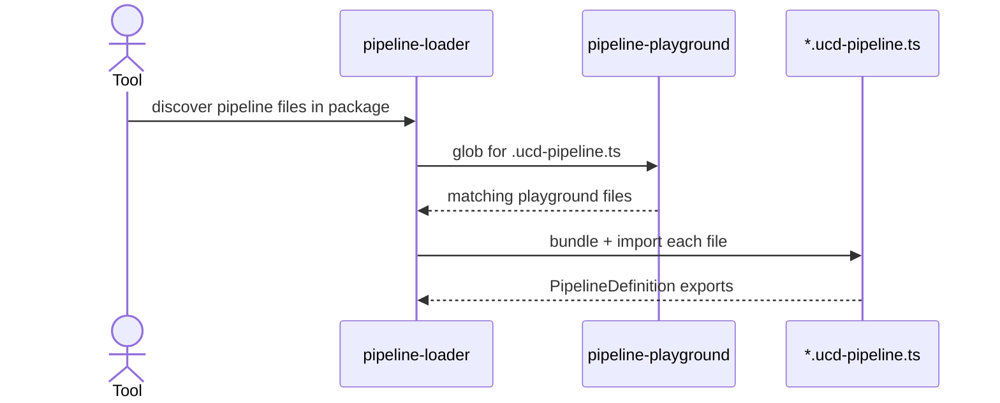
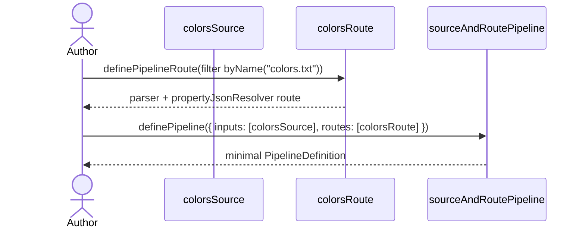
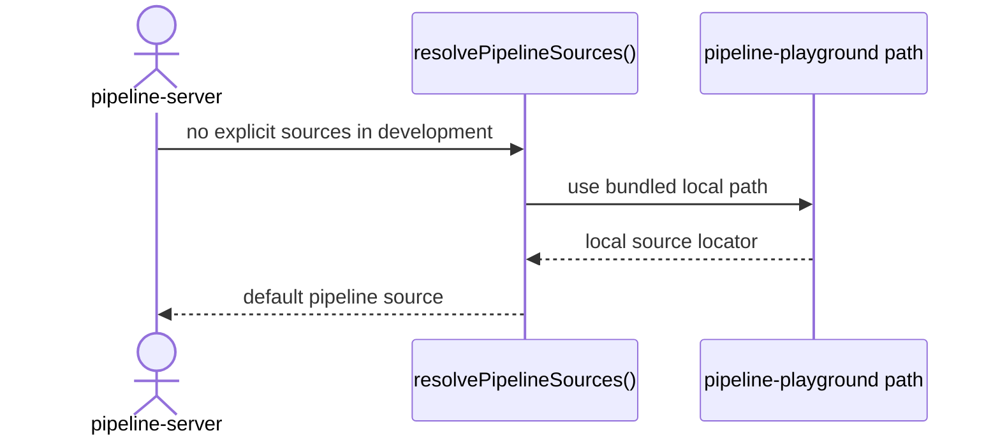

import { Cards, Card } from 'fumadocs-ui/components/card';

`@ucdjs/pipeline-playground` is the sample corpus of pipeline definitions used for experimentation, demos, and UI development.

## Role

- Provides concrete `.ucd-pipeline.ts` files for the loader and server to discover.
- Demonstrates simple, intermediate, advanced, and failure-oriented pipeline scenarios.
- Gives tests and the pipeline UI realistic inputs without depending on a separate external repo.

## Related Docs

<Cards>
  <Card title="Pipeline Loader" href="/architecture/packages/pipelines/loader" description="The loader discovers and imports the example pipeline files from this package." />
  <Card title="Pipeline Server" href="/architecture/packages/pipelines/server" description="In development, the server defaults to using this package as its local source." />
  <Card title="Pipeline Core" href="/architecture/packages/pipelines/core" description="These example files are authored with the pipeline-core DSL." />
  <Card title="Pipeline Presets" href="/architecture/packages/pipelines/presets" description="Many example pipelines compose preset parsers and resolvers." />
</Cards>

## Mental Model

This package is data and examples, not runtime infrastructure.

Its folders intentionally cover different documentation and testing scenarios:

- `simple/` for minimal examples
- `intermediate/` for transforms and custom resolvers
- `advanced/` for richer graphs
- `error-handling/` for broken or failure-producing cases

## Example Flows

### Loader discovering playground pipelines

### Simple example: `source-and-route`

### Development default source

## Design Notes

- Keeping examples in-repo makes UI and loader development reproducible.
- Failure examples are intentional and valuable because the loader and server need to surface issues cleanly.
- The playground is private because it is reference material, not a polished product surface.
- File names with `.ucd-pipeline.ts` are part of the contract so discovery works automatically.

## Testing Use

- loader discovery and import behavior
- UI states for successful, complex, and broken pipeline definitions
- documentation examples for the DSL
- development-mode default source selection in pipeline-server
