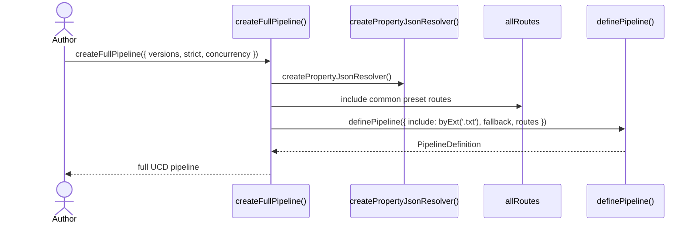
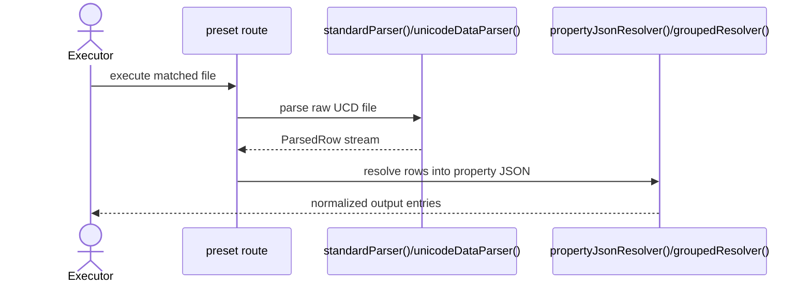
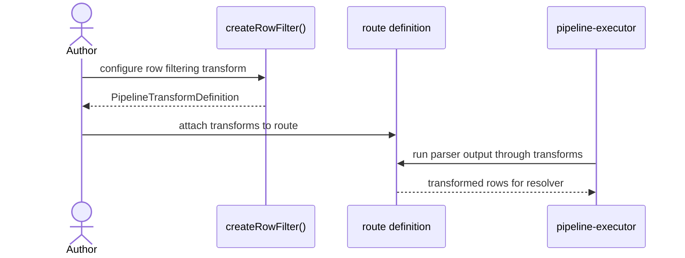

import { Cards, Card } from 'fumadocs-ui/components/card';

`@ucdjs/pipeline-presets` provides reusable parsers, routes, resolvers, transforms, and ready-made pipelines for Unicode data processing.

## Role

- Encapsulates common UCD parsing strategies and route definitions.
- Lets authors build useful pipelines quickly without recreating the standard building blocks.
- Bridges raw Unicode text formats and the generic pipeline DSL.

## Related Docs

<Cards>
  <Card title="Pipeline Core" href="/architecture/packages/pipelines/core" description="Presets are composed entirely on top of the pipeline DSL." />
  <Card title="Pipeline Executor" href="/architecture/packages/pipelines/executor" description="Preset pipelines are common runtime inputs to the executor." />
  <Card title="Pipeline Playground" href="/architecture/packages/pipelines/playground" description="Playground examples import these presets for realistic sample pipelines." />
  <Card title="Codegen" href="/architecture/packages/codegen" description="Both packages transform Unicode files, but presets target pipeline execution rather than TS code emission." />
</Cards>

## Mental Model

The package is a toolbox with three levels:

- low-level parsers and resolvers
- reusable route definitions and transforms
- complete preset pipelines like `createFullPipeline()`

It exists so most pipeline authors can compose, not invent.

## Method Flows

### `createFullPipeline()`

### Standard route processing

### Transform composition

## Design Notes

- Presets should encode common Unicode patterns, not every possible pipeline style.
- Ready-made pipelines like `createFullPipeline()` are intentionally opinionated.
- The package keeps raw-format knowledge close to the parser/resolver layer instead of scattering it across apps.
- Authors can always drop down to pipeline-core when presets are too constraining.

## Testing Use

- parser correctness for common UCD file formats
- resolver output normalization
- ready-made pipeline assembly
- transform behavior in preset routes
- compatibility with executor and playground example pipelines
