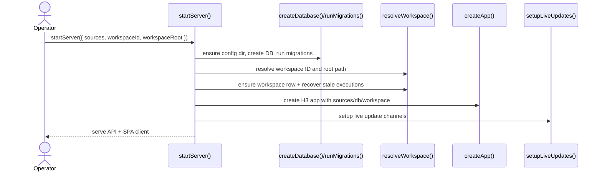
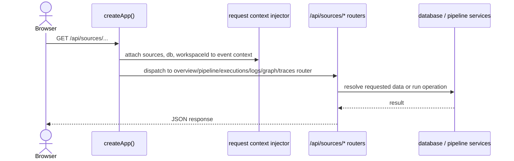
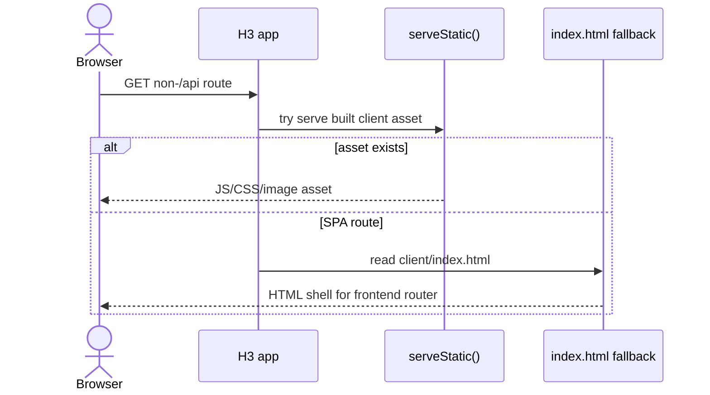

import { Cards, Card } from 'fumadocs-ui/components/card';

`@ucdjs/pipeline-server` is the local pipeline UI and API server for discovering, visualizing, and running pipelines.

## Role

- Hosts the interactive pipeline UI and the server API behind it.
- Resolves pipeline sources, manages workspace state, and persists execution history.
- Connects loader, executor, graph, tracing, and UI concerns in one package.

## Related Docs

<Cards>
  <Card title="Pipeline Loader" href="/architecture/packages/pipelines/loader" description="The server discovers and loads pipeline definitions through the loader package." />
  <Card title="Pipeline Executor" href="/architecture/packages/pipelines/executor" description="Executions triggered from the UI run through the executor package." />
  <Card title="Pipeline Graph" href="/architecture/packages/pipelines/graph" description="Graph APIs and UI views depend on pipeline graph data." />
  <Card title="Pipeline Playground" href="/architecture/packages/pipelines/playground" description="Development mode defaults to the example pipelines in pipeline-playground." />
</Cards>

## Mental Model

This package has two halves:

- server-side H3 app, database, workspace, and live updates
- client-side UI bundled into the same package

It is effectively the control plane for the pipeline toolchain.

## Method Flows

### `startServer()`

### Server API request

### SPA fallback and static asset serving

## Design Notes

- Workspace identity is stable and can come from either config or hashed root path.
- The package treats failed migrations as fatal, which is correct for a control-plane app.
- Server and client live together because the UI is tightly coupled to the API shape.
- Development defaults to the pipeline playground so the app is useful immediately.

## Testing Use

- workspace resolution and stale-execution recovery
- route behavior for sources, graph, executions, logs, and traces
- migration/bootstrap failures
- live update lifecycle
- SPA fallback and static serving
