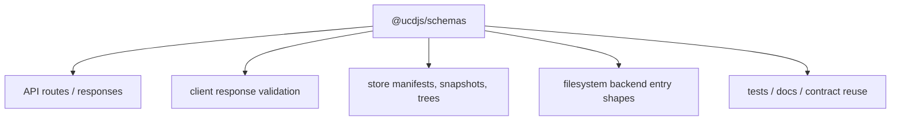
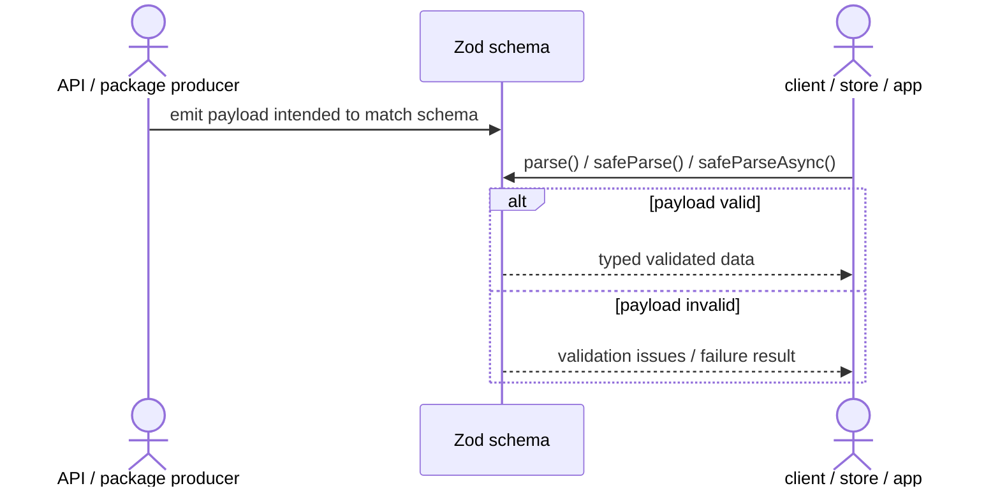
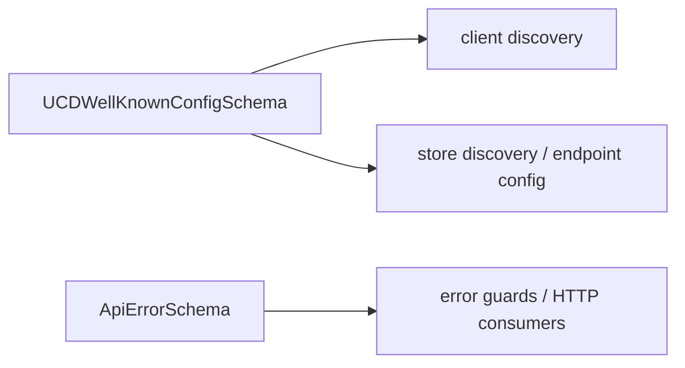
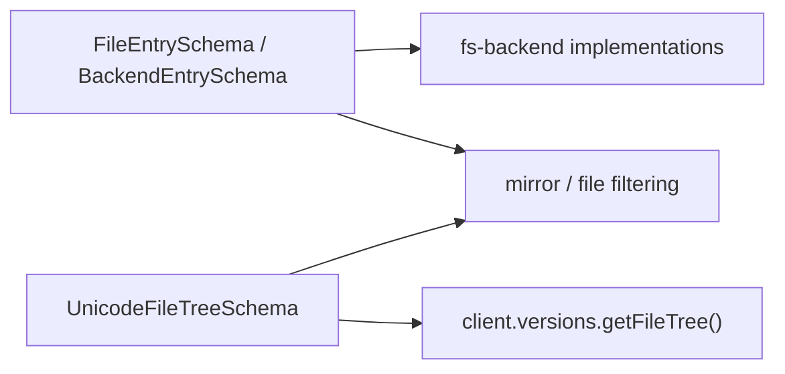
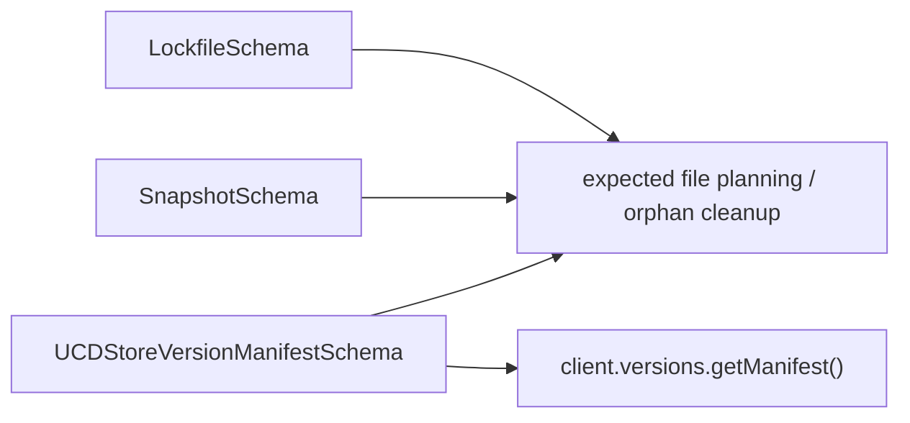

import { Cards, Card } from 'fumadocs-ui/components/card';

`@ucdjs/schemas` is the shared contract layer for structured data in UCD.js.

## Role

- Defines Zod schemas for API responses, manifests, lockfiles, filesystem entries, and Unicode metadata.
- Provides a single contract source for both producers and consumers.
- Keeps runtime validation and type inference aligned.

## Related Docs

<Cards>
  <Card title="Package Layers" href="/architecture/package-layers" description="See where schemas sits in the contract layer of the workspace." />
  <Card title="Client" href="/architecture/packages/client" description="Client resources validate API responses against schemas at runtime." />
  <Card title="UCD Store" href="/architecture/packages/ucd-store" description="Store uses manifest, lockfile, snapshot, and file-tree schemas." />
  <Card title="FS Backend" href="/architecture/packages/fs-backend" description="Filesystem backends and store-facing file shapes depend on schema definitions." />
</Cards>

## Mental Model

This package is not just “types in one place.” It is the runtime validation layer
that lets API producers, HTTP clients, and storage code agree on the same shapes.

Schema families in this package:

- `api`: well-known config and error response contracts
- `fs`: directory/file entry shapes for store and backend surfaces
- `lockfile`: `.ucd-store.lock` and `{version}/snapshot.json`
- `manifest`: expected-file and per-version manifest contracts
- `unicode`: versions, file trees, and version-detail payloads

## Contract Ownership

## Validation Flow

## Schema Families

### API Contracts

### Filesystem & Tree Contracts

### Lockfile & Manifest Contracts

## Testing Use

The high-value test categories here are:

- example payloads that should parse successfully
- malformed payloads that should fail with precise issues
- recursive tree/entry validation
- lockfile and snapshot date coercion
- manifest and well-known contract compatibility across producer/consumer code
