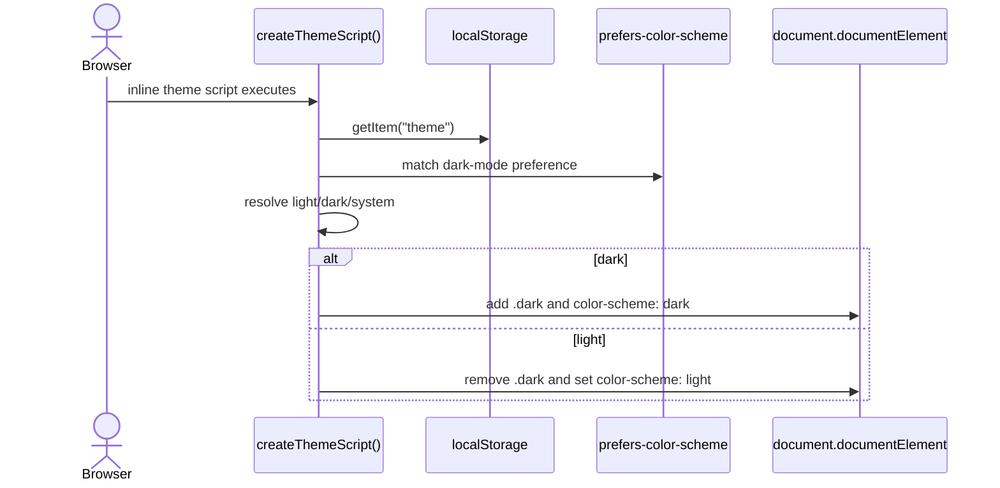
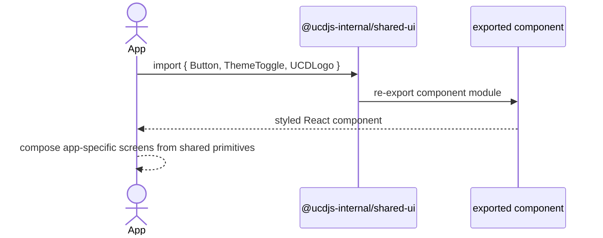
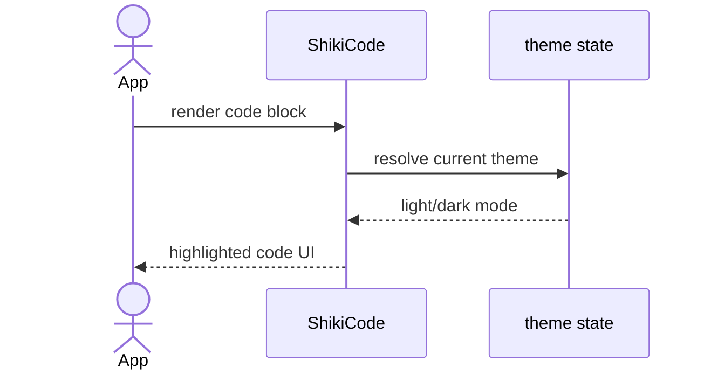

import { Cards, Card } from 'fumadocs-ui/components/card';

`@ucdjs-internal/shared-ui` is the internal component and theme package used by UI-facing apps.

## Role

- Provides reusable UI primitives and styled components for docs and pipeline UIs.
- Centralizes theme bootstrapping, utility helpers, and base shared styles.
- Keeps app code focused on composition instead of duplicating component scaffolding.

## Related Docs

<Cards>
  <Card title="Docs App" href="/architecture/apps/docs" description="The docs site consumes shared layout and styling patterns." />
  <Card title="Pipeline Server" href="/architecture/packages/pipelines/server" description="The pipeline UI also benefits from shared UI primitives and patterns." />
  <Card title="Shared" href="/architecture/packages/shared" description="Compare this UI-focused package with the non-visual internal helper package." />
  <Card title="Packages Overview" href="/architecture/packages" description="Return to the grouped package architecture index." />
</Cards>

## Mental Model

This package has three families of exports:

- UI primitives under `src/ui/*`
- higher-level components like `ThemeToggle`, `ShikiCode`, and `UCDLogo`
- tiny shared client helpers like theme bootstrapping and class-name utilities

It is not a design system with business logic. It is a shared presentation layer.

## Method Flows

### Theme bootstrap

### Shared component consumption

### Syntax-highlighted code block path

## Design Notes

- The package is intentionally internal so apps can evolve shared visuals without a public API promise.
- Theme bootstrapping is defensive and safe to inline before React hydrates.
- Most exports are composable primitives; app-level data fetching and navigation stay outside this package.
- Shared styles are useful only when the consuming app accepts the same visual language.

## Testing Use

- theme-script output and root-class toggling
- component rendering for shared primitives
- app integration points that depend on light/dark behavior
- regression tests for exported component surface and utility helpers
