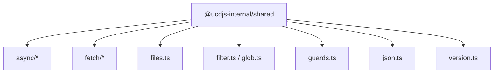
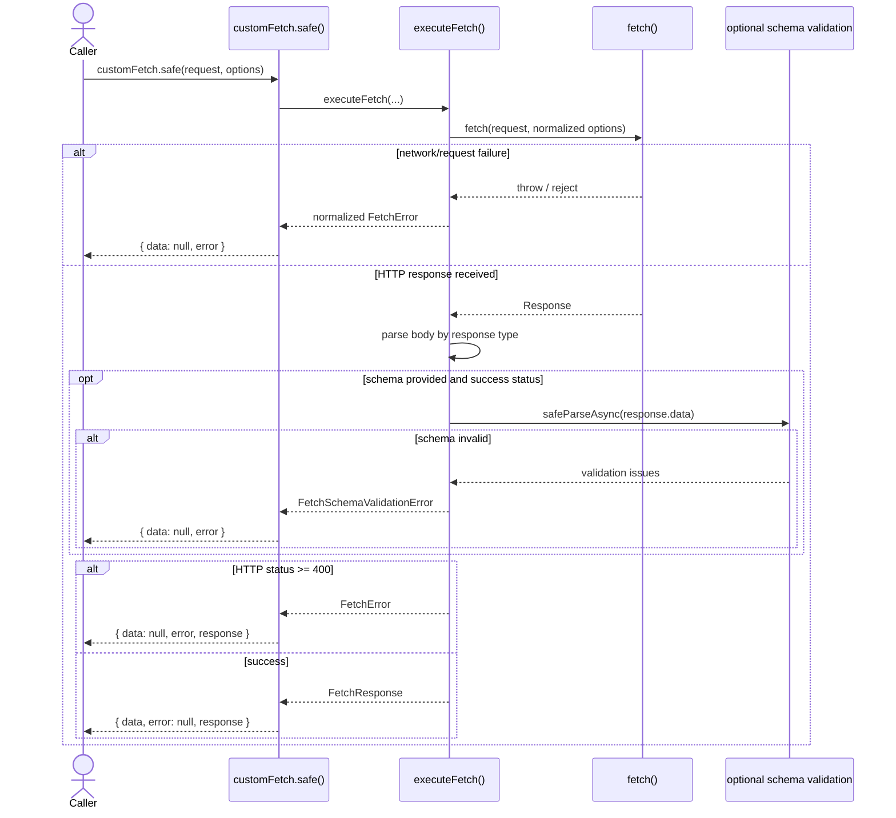
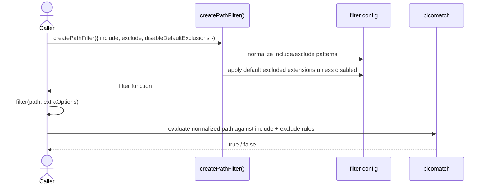
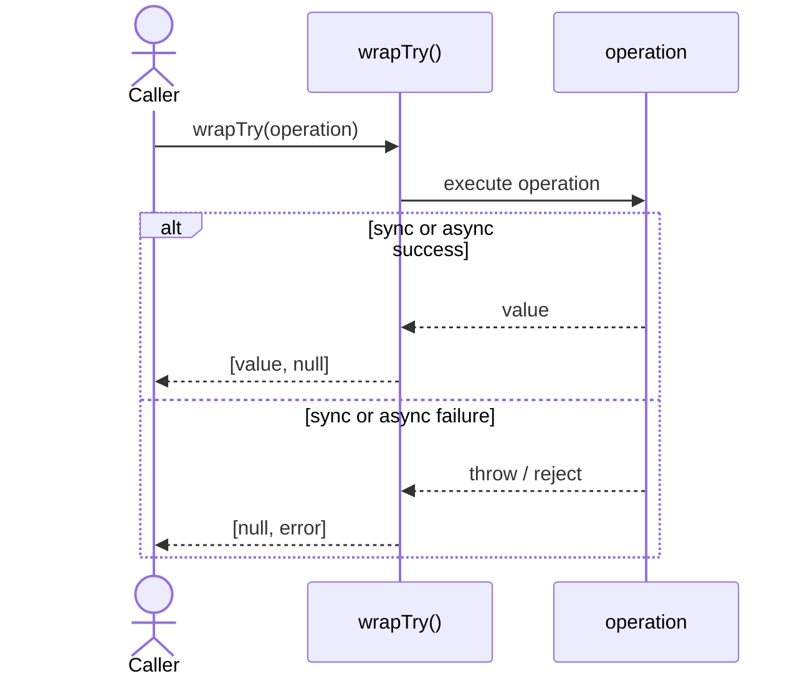
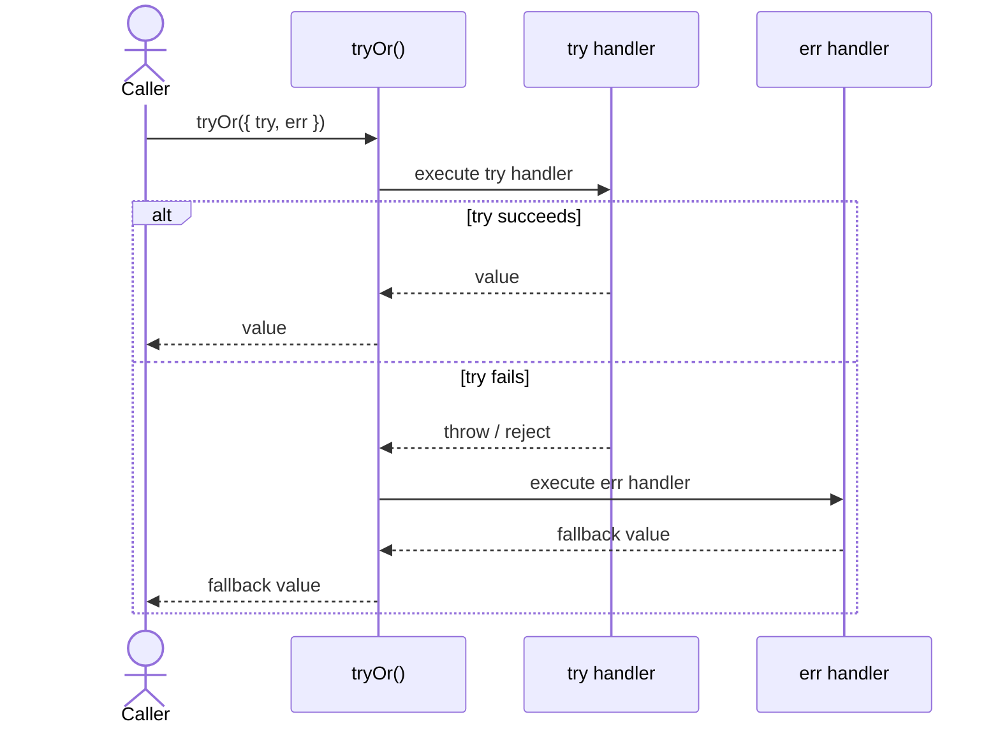
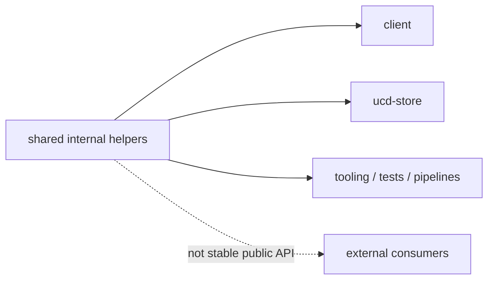

import { Cards, Card } from 'fumadocs-ui/components/card';

`@ucdjs-internal/shared` holds internal cross-package helpers.

## Role

- Provides reusable internal utilities for async work, fetch behavior, filtering, files, guards, and hashing.
- Supports workspace packages without promising external stability.
- Sits below domain packages such as client, store, and pipeline tooling.

## Related Docs

<Cards>
  <Card title="Utils" href="/architecture/packages/utils" description="The stable public facade re-exports a small subset of shared helpers." />
  <Card title="Client" href="/architecture/packages/client" description="Client resources rely on customFetch and guards from shared." />
  <Card title="UCD Store" href="/architecture/packages/ucd-store" description="Store operations depend heavily on wrapTry, path filters, and file helpers." />
  <Card title="Package Layers" href="/architecture/package-layers" description="See why shared stays internal and below business packages." />
</Cards>

## Mental Model

This package is the workspace’s implementation toolbox.

It is deliberately broad, but the exports still cluster into a few clear families:

- async helpers: concurrency limiting, `wrapTry`, `tryOr`
- fetch helpers: `customFetch`, normalized fetch errors, schema-aware responses
- path/file helpers: flattening, normalization, tree filtering
- glob and filter helpers
- small guards and serialization helpers

## Helper Families

## Method Flows

### `customFetch.safe()`

### `createPathFilter(options)`

### `wrapTry(operation)`

### `tryOr({ try, err })`

## Internal Boundary

## Testing Use

The highest-value tests here are:

- fetch normalization, retry, timeout, and schema-validation branches
- filter/path matching edge cases and default exclusions
- `wrapTry` / `tryOr` sync and async behavior
- file tree normalization and flattening helpers
