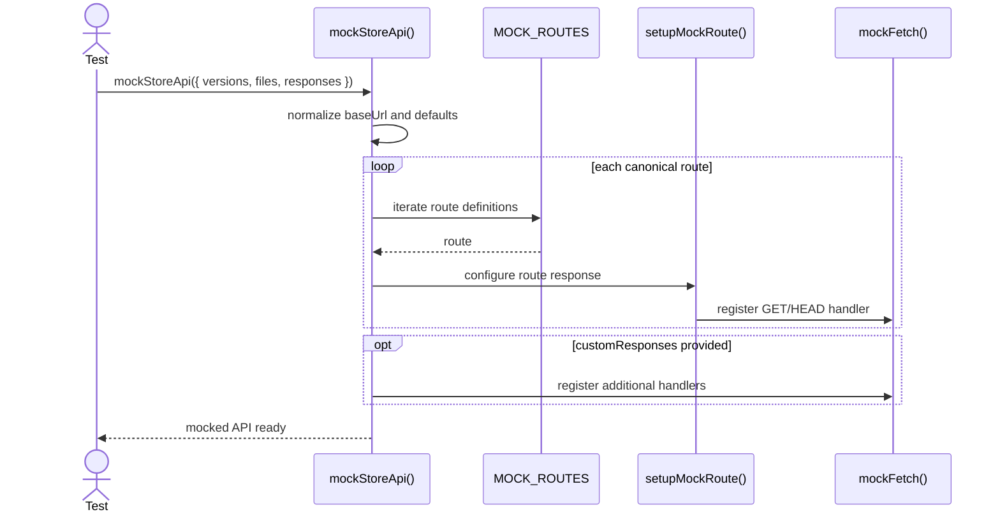
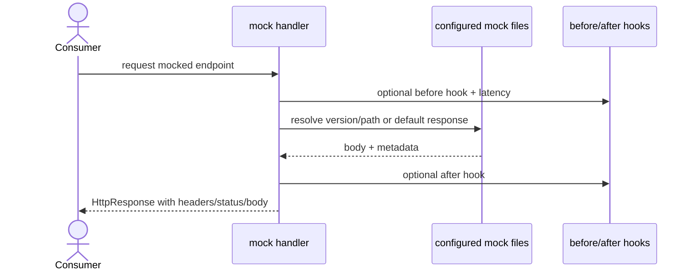
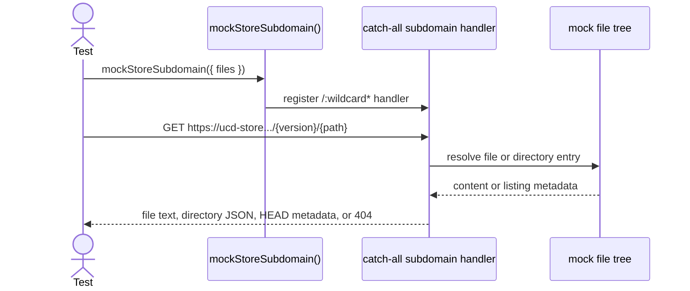

import { Cards, Card } from 'fumadocs-ui/components/card';

`@ucdjs/test-utils` provides reusable mocks, fixtures, and matchers for package and app tests across the monorepo.

## Role

- Supplies mock store APIs and subdomain handlers for client and store tests.
- Provides reusable backend fixtures and async helpers so tests do not rebuild plumbing each time.
- Encodes project-specific testing patterns in one place.

## Related Docs

<Cards>
  <Card title="Packages Overview" href="/architecture/packages" description="Return to the grouped package architecture index." />
  <Card title="UCD Store" href="/architecture/packages/ucd-store" description="Many store tests rely on mock store handlers and test backends from this package." />
  <Card title="Client" href="/architecture/packages/client" description="Client tests use the mock API surface defined here." />
  <Card title="FS Backend" href="/architecture/packages/fs-backend" description="Test backends exercise the same feature contract as production backends." />
</Cards>

## Mental Model

The package organizes around three needs:

- fake HTTP surfaces with MSW
- fake filesystems/backends for storage tests
- shared assertions and tiny async helpers

The most important entrypoint is `mockStoreApi()`, which stands up the canonical mocked UCD API.

## Method Flows

### `mockStoreApi(config)`

### Mocked request handling

### Store subdomain mocking

## Design Notes

- The mock API tracks the real endpoint shape, including the manifest route compatibility layer.
- Store-subdomain mocking exists because the HTTP backend talks to the hosted store directly, not only the API app.
- Default files are included so tests can start from a realistic baseline without a lot of fixture setup.
- The package is opinionated toward this monorepo’s testing style rather than being generic.

## Testing Use

- end-to-end client/store tests using realistic route mocks
- backend feature tests using memory or read-only test backends
- matcher setup for response and schema assertions
- latency, error, and custom-response branches for HTTP consumers
