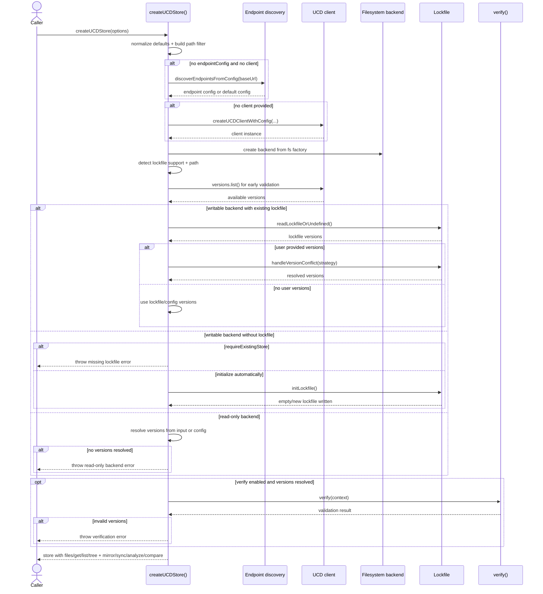
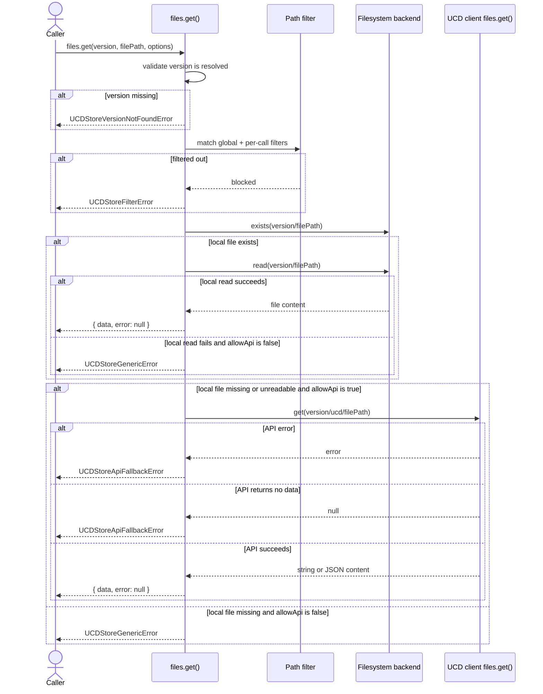
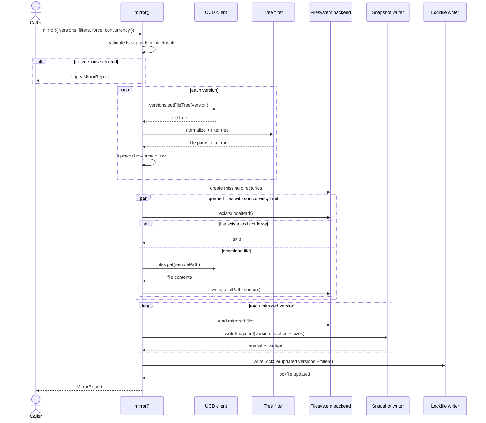
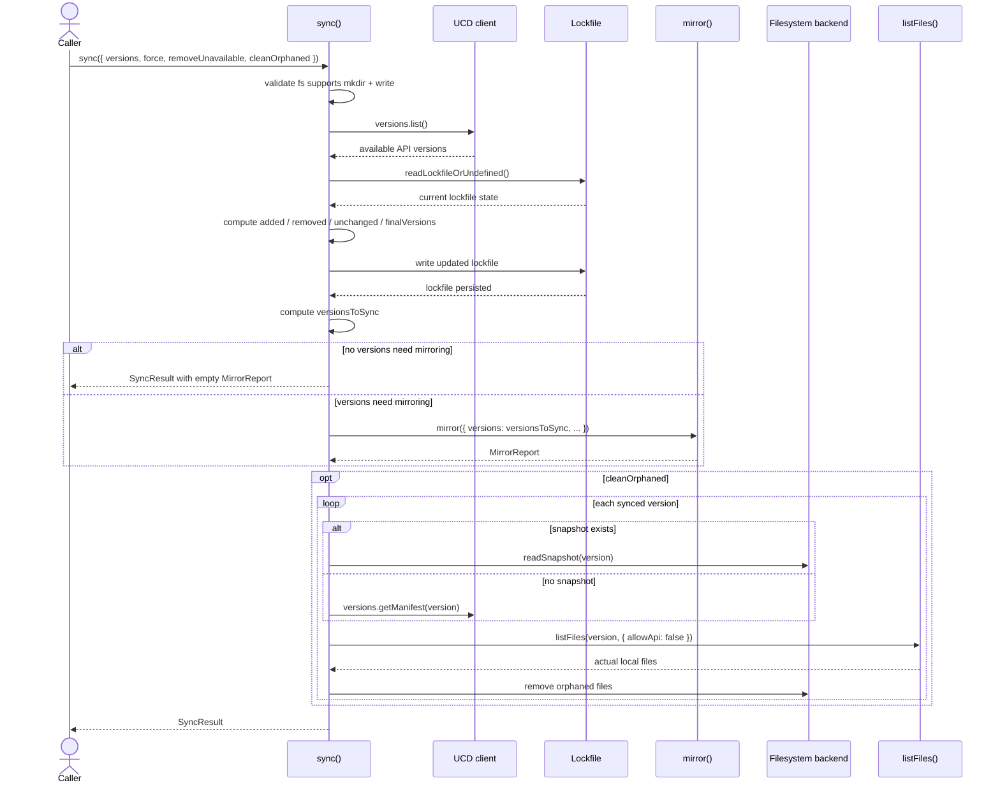

import { Cards, Card } from 'fumadocs-ui/components/card';

`@ucdjs/ucd-store` is the high-level storage coordination layer for UCD.js.

## Role

- Coordinates file access, mirroring, sync, verification, and reporting.
- Works across different backend types through `@ucdjs/fs-backend`.
- Bridges store metadata, local state, and remote file access behavior.

## Notes

Use this page for mode boundaries, metadata authority, and store-lifecycle notes.

## Modes

- `mirrored`: writable store lifecycle with `.ucd-store.lock` plus per-version snapshots
- `remote`: read-only store-compatible view backed by the store HTTP surface and API metadata

Store instances expose this distinction as `store.mode`.

## Related Docs

<Cards>
  <Card title="Public Package Docs" href="/packages/ucd-store" description="User-facing overview of the store package and its main lifecycle." />
  <Card title="Architecture Index" href="/architecture" description="Top-level architecture entrypoint for data flow, apps, and package notes." />
  <Card title="Package Layers" href="/architecture/package-layers" description="Dependency-layer view showing how ucd-store relates to lockfile and fs-backend." />
  <Card title="Data Flow" href="/architecture/data-flow" description="System-level flow from Unicode sources into storage and API consumers." />
</Cards>

## Method Flows

The diagrams below focus on the runtime behavior of the main store entrypoints.
They are intentionally close to the current implementation so they can be used
as both design docs and test-planning references.

### `createUCDStore()`

### `files.get()`

### `mirror()`

### `sync()`

## Testing Use

These sequence diagrams are also the right place to derive scenario matrices:

- initialization mode matrix: writable, read-only, lockfile present, lockfile absent
- file read matrix: local hit, filtered, local miss, API fallback success, API fallback failure
- mirror matrix: empty version set, skips, force re-download, API/tree failure, snapshot update
- sync matrix: add/remove versions, force mirror, remove unavailable, orphan cleanup
