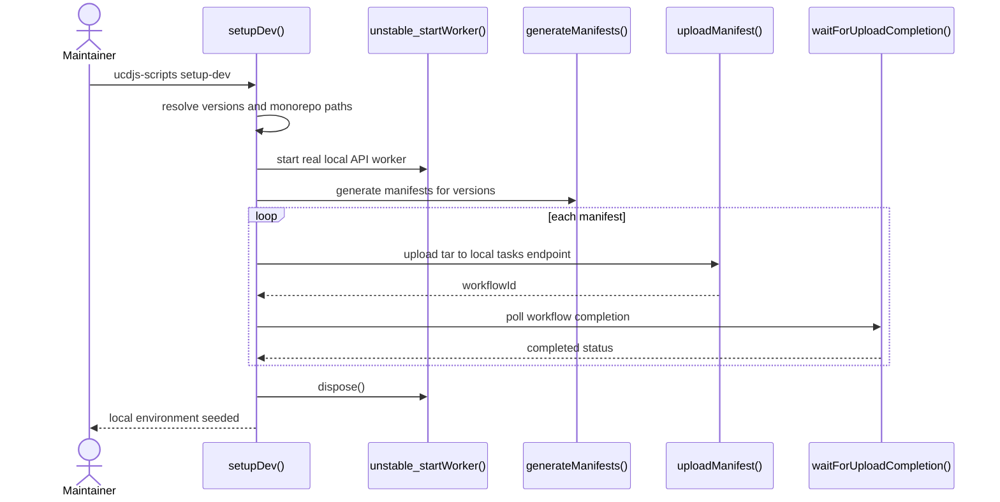
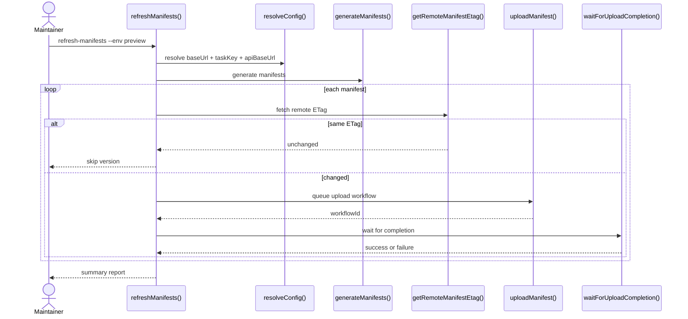
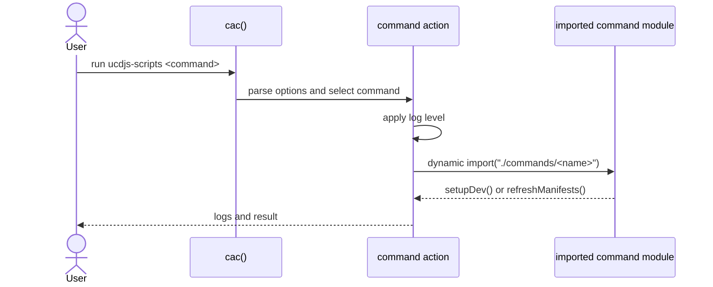

import { Cards, Card } from 'fumadocs-ui/components/card';

`@ucdjs/ucdjs-scripts` packages operational scripts for manifest generation and local environment seeding.

## Role

- Provides repo-specific operational commands that are too workflow-oriented for the public CLI package.
- Generates manifests, uploads them through task endpoints, and seeds local dev environments.
- Encodes deployment-oriented config resolution and upload behavior in one place.

## Related Docs

<Cards>
  <Card title="Codegen" href="/architecture/packages/codegen" description="Both packages transform raw Unicode inputs into higher-level artifacts, but this one is operational." />
  <Card title="API App" href="/architecture/apps/api" description="Manifest uploads target task endpoints exposed by the API worker." />
  <Card title="Store App" href="/architecture/apps/store" description="Uploaded manifests and snapshots ultimately feed the hosted store." />
  <Card title="Data Flow" href="/architecture/data-flow" description="See where manifest refresh and upload fits into the wider system." />
</Cards>

## Mental Model

This package is an operations CLI with two main workflows:

- `setup-dev`: spin up the real API worker locally and seed a set of versions
- `refresh-manifests`: generate manifests, compare ETags, queue uploads, and wait for completion

It is not the general user CLI. It is repo automation for maintainers.

## Method Flows

### `setup-dev`

### `refresh-manifests`

### CLI bootstrap

## Design Notes

- Upload workflows are task-driven so large manifest refreshes do not need to complete in one request.
- `setup-dev` starts the actual worker entrypoint instead of faking the tasks API.
- ETag comparison avoids unnecessary uploads when manifests have not changed.
- This package is intentionally operational and repo-specific, so a stable public API matters less than correct workflow behavior.

## Testing Use

- config resolution and environment overrides
- dry-run vs upload behavior
- ETag skip logic
- task queue / completion polling
- local worker bootstrap for development seeding
