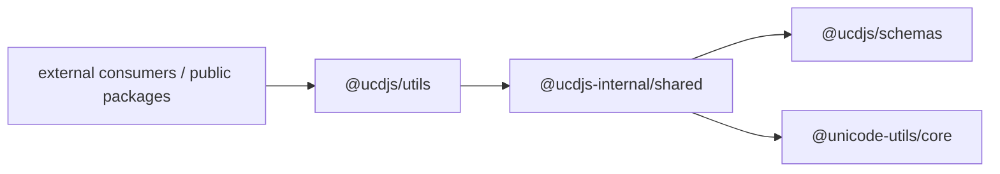
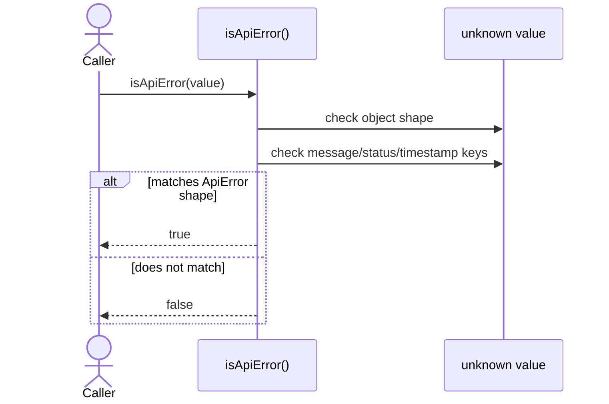
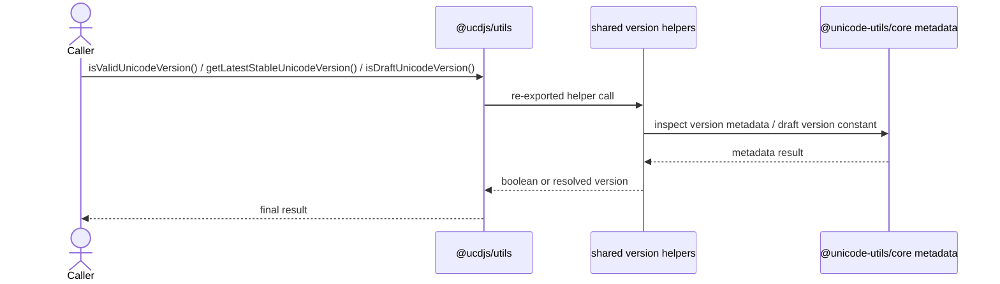
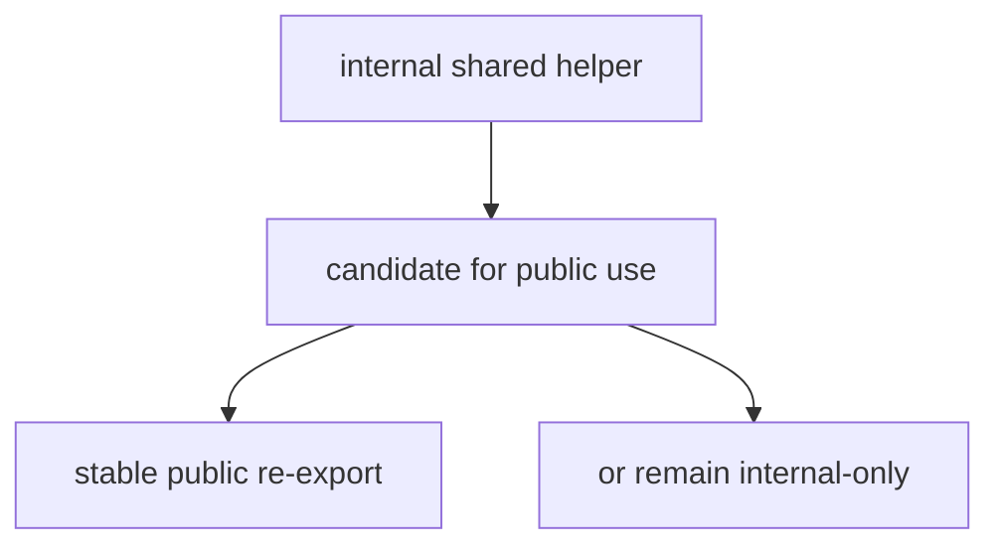

import { Cards, Card } from 'fumadocs-ui/components/card';

`@ucdjs/utils` provides the stable public utility facade for a small subset of shared helpers.

## Role

- Re-exports safe public helpers without exposing the full internal helper package.
- Gives external consumers a semver-respected entrypoint for common checks.
- Keeps internal helper churn isolated behind a smaller public surface.

## Related Docs

<Cards>
  <Card title="Shared" href="/architecture/packages/shared" description="Internal helper package that implements the underlying logic re-exported here." />
  <Card title="Schemas" href="/architecture/packages/schemas" description="isApiError() depends on the shared ApiError contract." />
  <Card title="Client" href="/architecture/packages/client" description="Client consumers often pair response handling with the exported guards here." />
  <Card title="Package Layers" href="/architecture/package-layers" description="See how utils differs from the internal shared package in stability expectations." />
</Cards>

## Mental Model

`@ucdjs/utils` is intentionally thin.

It does not try to be a giant utility package. Instead, it selects a few helpers
from `@ucdjs-internal/shared` and republishes them as stable public APIs:

- `isApiError`
- Unicode version classification helpers

## Public Facade Model

## Method Flows

### `isApiError(value)`

### Unicode Version Helpers

## Stability Boundary

## Testing Use

The tests that matter most here are:

- guard accuracy for `isApiError()`
- Unicode version helper correctness against metadata
- verification that the public facade exports exactly the intended stable helpers
