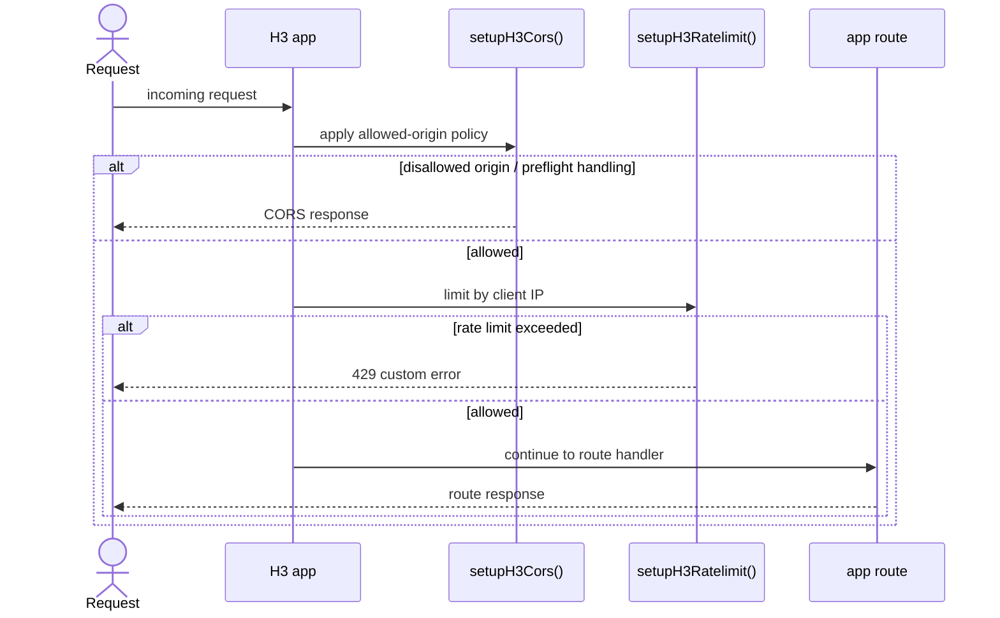
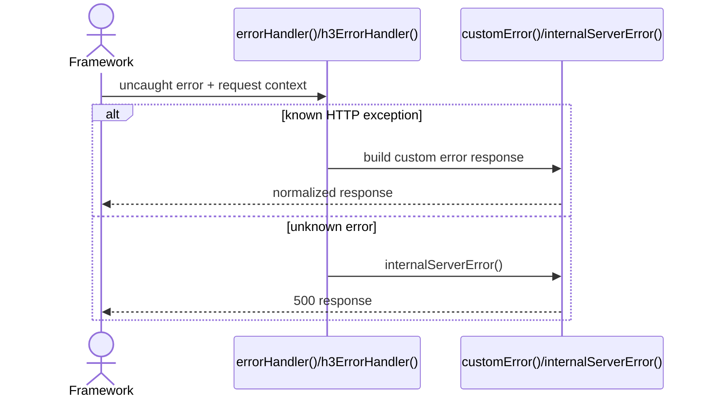
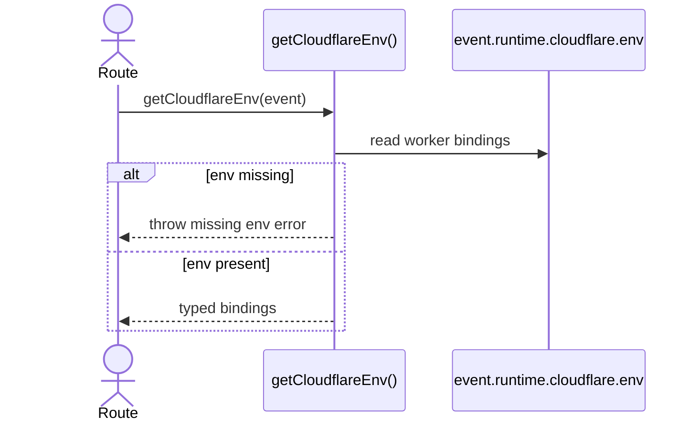

import { Cards, Card } from 'fumadocs-ui/components/card';

`@ucdjs-internal/worker-utils` centralizes shared request-handling behavior for Hono and H3 workers.

## Role

- Provides common error responses, handler glue, CORS, and rate-limiting setup.
- Normalizes Cloudflare/H3 environment access and request handling across worker apps.
- Keeps API-like apps consistent instead of re-implementing platform plumbing.

## Related Docs

<Cards>
  <Card title="API App" href="/architecture/apps/api" description="The public API worker composes these helpers during startup." />
  <Card title="Store App" href="/architecture/apps/store" description="The store worker uses the H3-specific helpers and error handling." />
  <Card title="Shared" href="/architecture/packages/shared" description="Compare request/runtime helpers here with the general internal utility package." />
  <Card title="Apps Overview" href="/architecture/apps" description="Return to the app architecture index." />
</Cards>

## Mental Model

There are two main surfaces:

- framework-agnostic response helpers and task helpers
- framework-specific setup helpers for Hono and H3

The point is policy reuse:

- same CORS rules
- same rate-limit strategy
- same normalized error payload shape

## Method Flows

### H3 request setup

### Error normalization

### Cloudflare env access

## Design Notes

- Worker apps should compose these helpers early in startup so every route shares the same policy.
- H3 and Hono have separate adapters because the request lifecycle is different even when the policy is the same.
- Normalized errors are more important than perfect framework parity.
- Environment access is strict so misconfigured workers fail clearly.

## Testing Use

- CORS origin allow/deny cases
- rate-limiter success vs rejection
- typed environment access for worker bindings
- error normalization for expected and unexpected failures
