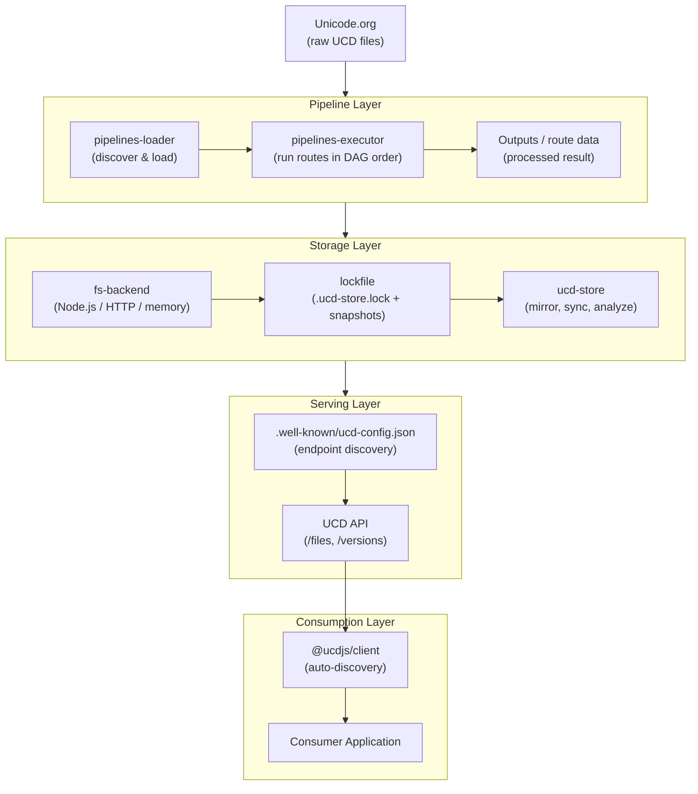
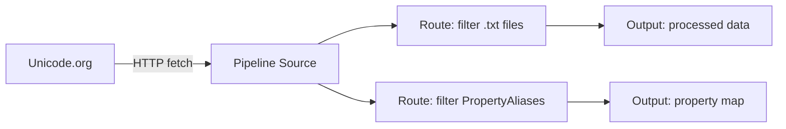
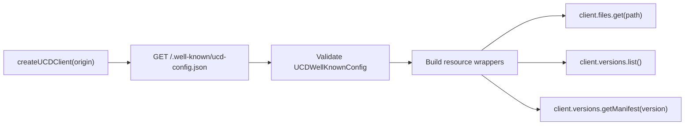

This page traces how Unicode data moves through the UCD.js system — from raw files on Unicode.org all the way to a consumer application using the API client.

## Overview



## Step-by-step

### 1. Ingestion

Raw UCD files are fetched from `unicode.org` (or a configured mirror). A pipeline definition specifies one or more **sources** and a set of **routes** describing how those files should be processed.



Routes form a **directed acyclic graph (DAG)**. The executor resolves the dependency order and runs routes concurrently where possible.

### 2. Storage

Processed outputs and derived data packages are persisted via `@ucdjs/ucd-store`, which works with backend-style filesystem access. Common backend patterns include:

| Backend pattern | Usage |
|---|---|
| Node backend | Read/write local disk (server-side) |
| HTTP backend | Read-only access over HTTP |
| In-memory backend | Tests and ephemeral execution |

State is tracked in two lockfile files written by `@ucdjs/lockfile`:

- `.ucd-store.lock` — version index listing all mirrored versions
- `{version}/snapshot.json` — per-version snapshot with file hashes and sizes

### 3. Serving

The store is served over HTTP. A `.well-known/ucd-config.json` document is published at the API origin to advertise endpoint paths:

```json
{
  "version": "0.1",
  "endpoints": {
    "files": "/api/v1/files",
    "versions": "/api/v1/versions",
    "manifest": "/api/v1/versions/{version}/manifest"
  }
}
```

This allows the server to route API paths however it wants (e.g. behind an edge proxy) without breaking clients. Older deployments may still keep the deprecated `/.well-known/ucd-store/{version}.json` alias for compatibility.

### 4. Consumption

`@ucdjs/client` fetches `.well-known/ucd-config.json` during initialization and constructs typed resource wrappers from the discovered endpoints.



Alternatively, `createUCDClientWithConfig()` skips the discovery request and accepts the config object directly — useful when the endpoint map is known ahead of time or when the `.well-known` endpoint is unavailable.

## Error handling

Resource methods (`client.files.get()`, etc.) always return `{ data, error }` rather than throwing. Only `createUCDClient()` itself can throw — if the `.well-known` document is missing or invalid, there is no safe way to continue.

```typescript
const { data, error } = await client.versions.list();

if (error) {
  // error is typed as UCDApiError
  console.error(error.message);
} else {
  console.log(data);
}
```
