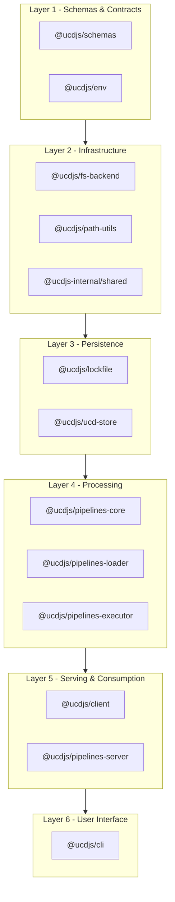

import { Cards, Card } from 'fumadocs-ui/components/card';

UCD.js is a monorepo of TypeScript packages for ingesting, storing, processing, serving, and consuming Unicode Character Database (UCD) files. Packages are organized into six layers, each building on the one below it.

## Available Pages

<Cards>
  <Card title="Data Flow" href="/contributing/development/architecture/data-flow" description="End-to-end flow from raw UCD files to client consumption" />
  <Card title="Package Layers" href="/contributing/development/architecture/package-layers" description="Detailed package dependency graph organized by layer" />
  <Card title="Apps" href="/contributing/development/architecture/apps" description="Per-app architecture notes and boundaries" />
  <Card title="Packages" href="/contributing/development/architecture/packages" description="Per-package architecture notes and extension points" />
  <Card title="UCD Store" href="/packages/ucd-store" description="Store internals: backends, lockfile, and sync operations" />
</Cards>
