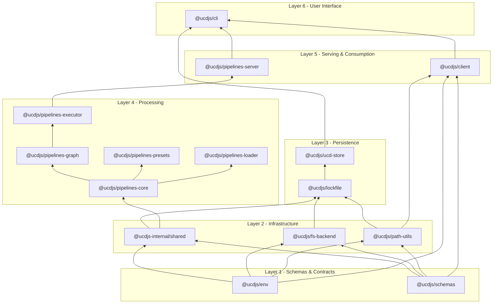
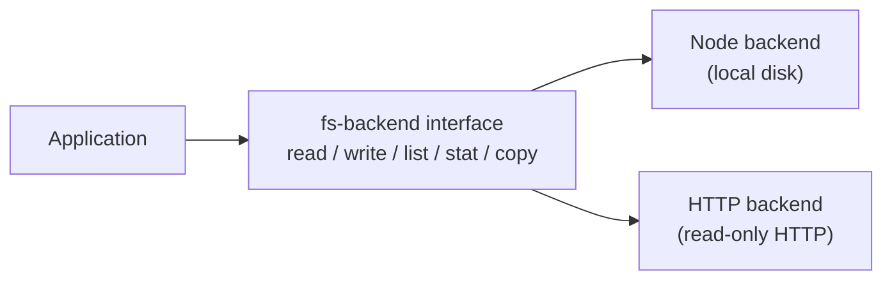
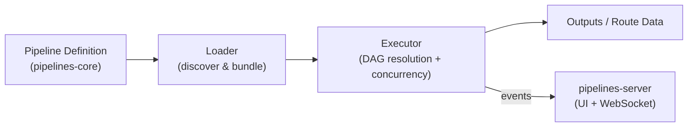

import { TypeTable } from 'fumadocs-ui/components/type-table';

The monorepo is organized into six dependency layers. Packages in a higher layer depend on packages in lower layers - never the other way around. This keeps the dependency graph acyclic and makes individual packages testable in isolation.

## Layer 1 - Schemas & Contracts

The foundation. No workspace dependencies.

| Package | Purpose |
|---|---|
| `@ucdjs/schemas` | Zod schemas for all data contracts: API responses, lockfiles, manifests, Unicode metadata |
| `@ucdjs/env` | Runtime constants (`UCDJS_API_BASE_URL`), HTTP stat headers, `requiredEnv()` |

`@ucdjs/schemas` is the single source of truth for every data shape in the system. If a package receives or emits structured data, its shape is defined here.

## Layer 2 - Infrastructure

Low-level utilities with no business logic.

| Package | Purpose |
|---|---|
| `@ucdjs-internal/shared` | Internal helpers: async utilities, fetch wrappers, path filters, API guards |
| `@ucdjs/fs-backend` | Filesystem abstraction for Node.js, HTTP, and custom backends |
| `@ucdjs/path-utils` | Path manipulation utilities built on top of `pathe` |

`@ucdjs-internal/shared` is intentionally marked internal - it may ship breaking changes in patch releases. Consumer packages should use `@ucdjs/utils` instead.

### fs-backend implementations

The backend abstraction keeps storage code environment-agnostic. The same `lockfile` and `ucd-store` code can run against a local filesystem in development or a remote HTTP endpoint in read-only contexts.

## Layer 3 - Persistence

| Package | Purpose |
|---|---|
| `@ucdjs/lockfile` | Manages `.ucd-store.lock` (version index) and `{version}/snapshot.json` (per-version file hashes) |
| `@ucdjs/ucd-store` | High-level store operations: mirror, sync, compare, analyze, validate |

The lockfile is the canonical record of what has been mirrored. It is the only mutable output that both the write path (pipelines/sync) and the read path (client/API) agree on.

## Layer 4 - Processing (Pipelines)

| Package | Purpose |
|---|---|
| `@ucdjs/pipelines-core` | Pipeline DSL: `definePipeline()`, sources, routes, transforms, filters, and outputs |
| `@ucdjs/pipelines-graph` | DAG representation of pipeline route dependencies |
| `@ucdjs/pipelines-loader` | Discover and load pipeline definitions from the filesystem |
| `@ucdjs/pipelines-executor` | Execute pipelines with concurrency, caching, logs, traces, and published-output ordering |
| `@ucdjs/pipelines-presets` | Shared parsers, resolvers, routes, and pipeline factories for common UCD processing tasks |

Routes inside a pipeline form a directed acyclic graph. The executor uses `pipelines-graph` to resolve the dependency order and run routes concurrently where the graph allows it.

### Route execution model

## Layer 5 - Serving & Consumption

| Package | Purpose |
|---|---|
| `@ucdjs/client` | HTTP client with `.well-known` auto-discovery and typed resource wrappers |
| `@ucdjs/pipelines-server` | Full-stack server for pipeline execution monitoring (React + H3 + LibSQL) |

## Layer 6 - User Interface

| Package | Purpose |
|---|---|
| `@ucdjs/cli` | `ucd` binary - the highest-level integration point; wraps store, client, pipelines, and codegen |

## Internal vs public packages

Packages prefixed with `@ucdjs-internal/` (`shared`, `worker-utils`, `shared-ui`) are allowed to make breaking changes in patch releases. Do not depend on them from external projects.

| Stable public | Internal / volatile |
|---|---|
| `@ucdjs/*` | `@ucdjs-internal/*` |
| Semver respected | May break in patches |
| Safe to consume externally | Workspace-only use |
