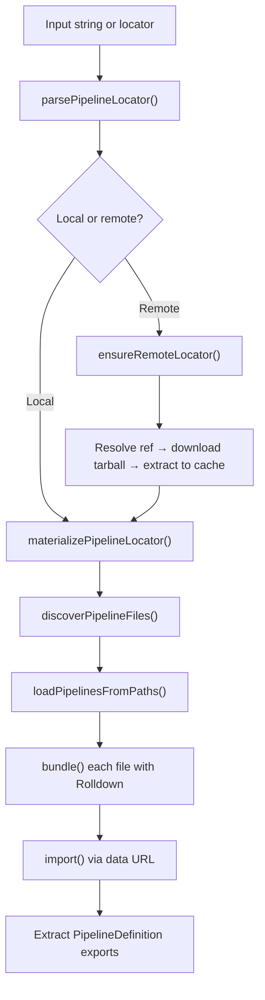
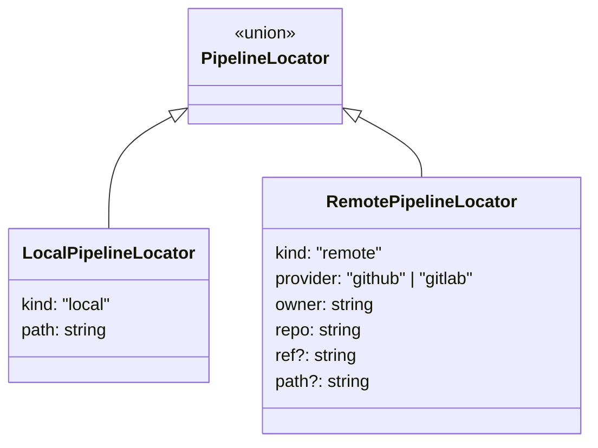
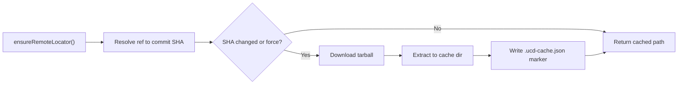
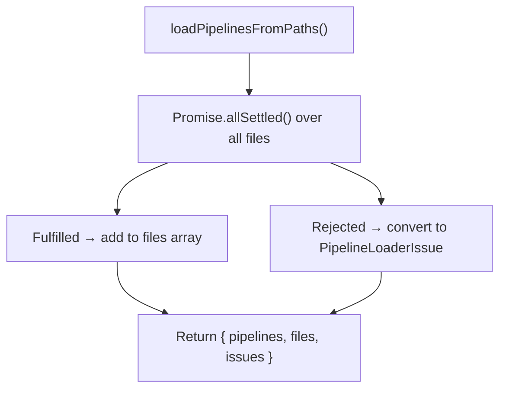

`@ucdjs/pipeline-loader` discovers and loads pipeline definitions from local and remote sources.

## Role

- Finds `.ucd-pipeline.ts` files and prepares them for execution.
- Owns loading behavior for local and remote pipeline sources.
- Separates definition discovery from runtime execution.
- Bundles TypeScript pipeline definitions into importable ESM using Rolldown.
- Manages cache for remote repository sources (GitHub, GitLab).

## Lifecycle

The loader follows a linear pipeline from raw input to loaded definitions:



### Step-by-step

1. **Parse** - `parsePipelineLocator(input)` turns a string into a `PipelineLocator` (local path or remote reference).
2. **Sync** (remote only) - `ensureRemoteLocator()` resolves the git ref to a commit SHA, downloads the repository tarball, extracts it to the cache directory, and writes a `.ucd-cache.json` marker.
3. **Materialize** - `materializePipelineLocator(locator)` resolves the locator to a concrete filesystem path (the cache dir for remote sources, or the local path directly).
4. **Discover** - `discoverPipelineFiles({ repositoryPath })` globs for `**/*.ucd-pipeline.ts` files, returning absolute paths and relative paths.
5. **Load** - `loadPipelinesFromPaths(filePaths)` bundles each file with Rolldown, imports the resulting ESM via a `data:` URL, and extracts all named exports that satisfy `isPipelineDefinition()`.

## Modules

| Module | Responsibility |
|--------|---------------|
| `locator.ts` | Parses locator strings into `LocalPipelineLocator` or `RemotePipelineLocator` |
| `materialize.ts` | Resolves a `PipelineLocator` to a filesystem path, checking existence and cache status |
| `discover.ts` | Globs for `.ucd-pipeline.ts` files in a repository path |
| `loader.ts` | Orchestrates bundle + import for each discovered file, collects results and issues |
| `bundle.ts` | Bundles a single TypeScript entry with Rolldown into ESM, returns code and a `data:` URL |
| `remote.ts` | Downloads and extracts remote repository archives, checks for updates |
| `cache.ts` | Reads/writes `.ucd-cache.json` markers, lists and clears cached sources |
| `errors.ts` | Defines `PipelineLoaderIssue` and typed error classes |
| `adapters/github.ts` | GitHub ref resolution and archive download |
| `adapters/gitlab.ts` | GitLab ref resolution and archive download |

## Locator format

Pipeline sources are identified by locator strings:

```text
# Local - file or directory path
/path/to/directory
./relative/path/to/file.ucd-pipeline.ts

# GitHub
github://owner/repo
github://owner/repo?ref=main
github://owner/repo?ref=v1.0.0&path=src/pipelines

# GitLab
gitlab://owner/repo?ref=main
```

`parsePipelineLocator()` produces a discriminated union:



## Bundling

Pipeline definitions are written in TypeScript and may import from npm packages or other local files. The loader uses **Rolldown** to bundle each `.ucd-pipeline.ts` file into a self-contained ESM chunk.

The bundled code is converted to a `data:text/javascript;base64,...` URL and imported via dynamic `import()`. This avoids writing temporary files to disk and ensures each pipeline file is loaded in isolation.

Bundle errors are classified into:
- `BundleResolveError` - an import could not be resolved (missing dependency or wrong path)
- `BundleTransformError` - a parse or syntax error in the source file

## Remote sources and caching

Remote sources go through a sync step before materialization:



### Cache structure

Remote sources are cached under the UCD config directory:

```text
~/.config/ucd/cache/repos/
  └── github/
      └── owner/
          └── repo/
              └── main/
                  ├── .ucd-cache.json    # marker with commitSha, syncedAt
                  ├── src/
                  │   └── *.ucd-pipeline.ts
                  └── ...
```

The `.ucd-cache.json` marker tracks the commit SHA and sync timestamp. When `ensureRemoteLocator()` runs, it compares the cached SHA against the remote - if they match, it skips the download.

Cache management functions:
- `listCachedSources()` - enumerate all cached repositories
- `clearRemoteSourceCache()` - remove a specific cached source
- `checkRemoteLocatorUpdates()` - check if a remote source has new commits without downloading

### Archive security

Archive extraction includes path traversal protection:
- Strips the root prefix from tarball entries
- Normalizes paths and rejects `..` segments
- Validates that all output paths resolve inside the target directory

## Error model

The loader uses structured `PipelineLoaderIssue` objects instead of throwing at every step. Discovery and loading collect issues and return them alongside successful results.



### Issue codes

| Code | Scope | When |
|------|-------|------|
| `INVALID_LOCATOR` | locator | Remote path resolves outside the repository |
| `CACHE_MISS` | repository | Remote source not yet synced to local cache |
| `REF_RESOLUTION_FAILED` | repository | Could not resolve git ref to a commit SHA |
| `DOWNLOAD_FAILED` | repository | Archive download failed |
| `MATERIALIZE_FAILED` | file | Locator path does not exist on disk |
| `DISCOVERY_FAILED` | discovery | Glob operation failed |
| `BUNDLE_RESOLVE_FAILED` | bundle | Import could not be resolved during bundling |
| `BUNDLE_TRANSFORM_FAILED` | bundle | Parse or syntax error during bundling |
| `IMPORT_FAILED` | import | Dynamic import of the bundled module failed |
| `INVALID_EXPORT` | import | Export does not satisfy `isPipelineDefinition()` |

### Error class hierarchy

```text
PipelineLoaderError (base)
├── CacheMissError
├── BundleError
├── BundleResolveError
└── BundleTransformError
```

## Notes

- Pipeline files must use the `.ucd-pipeline.ts` suffix to be discovered automatically. Custom glob patterns can be passed to `discoverPipelineFiles()`.
- The loader skips `default` exports - only named exports are inspected for pipeline definitions.
- `loadPipelinesFromPaths()` uses `Promise.allSettled` so a single failing file does not prevent other files from loading. Consumers should always check `result.issues`.
