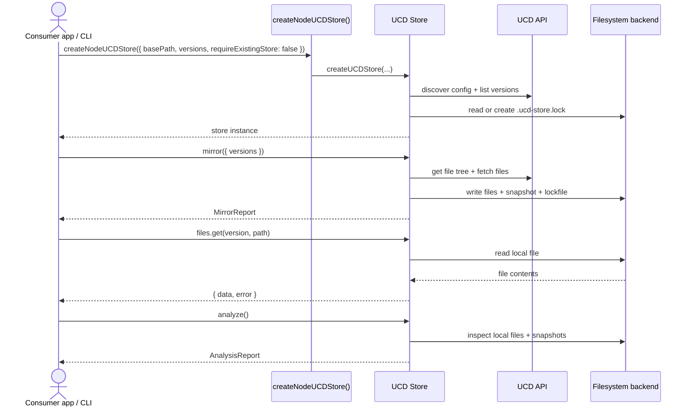

import { Callout } from 'fumadocs-ui/components/callout';
import { Cards, Card } from 'fumadocs-ui/components/card';

The `@ucdjs/ucd-store` package is the high-level coordination layer for Unicode Character Database storage access. It can operate as a mirrored local store or as a remote store-compatible view over HTTP, exposes the resolved `store.mode`, and coordinates lockfile/snapshot metadata, file access, mirroring, sync, verification, and reporting.

## Installation

```package-install
@ucdjs/ucd-store
```

## Overview

A mirrored store is a directory on disk containing UCD files organized by version. It is described by a `.ucd-store.lock` lockfile that records which versions are tracked plus per-version snapshot metadata. Remote stores expose the same file-oriented read surface without the local mirroring lifecycle.

## Modes

Store instances expose a `mode` property:

- `mirrored`: writable local store lifecycle with lockfile and snapshot state
- `remote`: read-only store-compatible access backed by the store HTTP surface and API metadata

## Related Docs

<Cards>
  <Card title="Architecture Notes" href="/architecture/packages/ucd-store" description="Detailed store internals, sequence diagrams, and lifecycle notes." />
  <Card title="Store CLI" href="/packages/cli/store" description="Command-line entrypoints for init, mirror, sync, verify, and analyze." />
  <Card title="Package Layers" href="/architecture/package-layers" description="See where ucd-store fits in the workspace dependency graph." />
  <Card title="Data Flow" href="/architecture/data-flow" description="Follow how Unicode data moves into storage and out to consumers." />
</Cards>

## Core Operations

| Operation | Description |
|---|---|
| **mirror** | Download UCD files for one or more versions |
| **sync** | Bring the store on disk in line with the lockfile |
| **verify** | Check local files against the remote API |
| **analyze** | Report on the contents and status of the store |
| **status** | Show which versions are present and their state |

<Callout type="info">
  All of these operations are available through the [`ucd store`](/packages/cli/store) CLI commands without writing any code.
</Callout>

## File System Backends

The store works with filesystem-style backends for local disk access, remote HTTP access, and testing-friendly in-memory implementations. In the public docs, the backend model is documented through [`@ucdjs/fs-backend`](/packages/fs-backend).

<Callout type="info">
  If you are building tooling around store-style file access, start with <a href="/packages/fs-backend"><code>@ucdjs/fs-backend</code></a>.
</Callout>

## Lockfile

The `.ucd-store.lock` file is the source of truth for a mirrored local store. It records:

- Which Unicode versions are tracked
- Which files belong to each version
- A content hash per file for integrity verification

The lockfile is written on `init` and `mirror`, and read by `sync` and `verify` to determine what should be on disk.

## Typical Lifecycle

This is the most common high-level usage flow for a writable store.



For the method-level execution diagrams, see the
[`ucd-store` architecture notes](/architecture/packages/ucd-store).

## API Reference

Documentation for the programmatic API will be added as the package stabilizes.
